# System-level AI coordination

The optional system coordinator coordinates **development work** across services of
any stack. It supports separate repositories and service directories in a
monorepo. Discovery/planning have no dependency on PHP, a model provider, the
Harness server, LangGraph, or a deployed application. Execution uses a local
provider CLI/adapter and the generic native Python Brain runtime. Python 3.9+
on Linux, macOS or native Windows is required; Git is
optional and contributes commit provenance when available. On Windows, a worker
CLI installed by npm starts through Node.js directly, never through its `.cmd`
launcher, and each worker's process tree is ended with its Windows job. AI
discovery in the Harness runs there in Codex's elevated sandbox.

The planning workflow is:

```text
task → service candidates → declared contract consumers → bounded source context
     → reviewable cross-service plan → source freshness check
```

Plans are read-only inputs. Explicit `execute` and `resume` commands launch
sequential workers, bind native Brain tasks and save dispatch receipts. Execution
defaults to read-only investigation; `--mode edit` authorizes scoped service edits.
The coordinator does not commit, merge or deploy. Capability states and relationships are **declarations**; reading a file
and hashing it establishes source currency, not correctness or deployment state.

## Try the complete example

Run from the AI-Infrastructure repository root:

```bash
python3 scripts/ai_system.py validate --system docs/examples/ai-system/system.json
python3 scripts/ai_system.py catalog --system docs/examples/ai-system/system.json
python3 scripts/ai_system.py map --system docs/examples/ai-system/system.json
python3 scripts/ai_system.py locate --system docs/examples/ai-system/system.json --task cancel-order
python3 scripts/ai_system.py plan --system docs/examples/ai-system/system.json \
  --task "Define cancellation and refund behavior" --change-id chg-001 \
  --service orders --context-budget 8000 --output /tmp/ai-system-chg-001.json
python3 scripts/ai_system.py verify --system docs/examples/ai-system/system.json \
  --plan /tmp/ai-system-chg-001.json
```

Choose a new output filename if the file already exists. Output creation never
overwrites an existing file or follows a link; its parent must exist. The
commands return JSON except `map`, which emits Mermaid. All declaration/query
commands are read-only. `plan --output` writes only the explicitly requested
new file; `init` creates only the new system workspace.

The [example system](examples/ai-system/system.json) has three synthetic services:


```mermaid
flowchart LR
    orders -->|order.cancelled| payments
    payments -->|refund.completed| notifications
```

This is a specification fixture. Its capabilities are `planned`, not claimed
implemented or deployed features. The example contracts use simple JSON, not
complete OpenAPI/AsyncAPI documents. Real services keep their actual HTTP,
event, RPC, GraphQL, or other contract format.

## Register your system

Create a new workspace; the parent directory must already exist:

```bash
python3 /path/to/AI-Infrastructure/scripts/ai_system.py init \
  --root /workspace/ai-system --name "Product system"
```

This seeds `system.json`, an AI coordination policy, and a short guide. It does
not install a framework edition or a memory runtime. Edit `system.json`:

```json
{
  "schema_version": 1,
  "name": "Product system",
  "services": [
    {"id": "orders", "root": "../orders", "manifest": "ai-service.json"},
    {"id": "payments", "root": "../payments", "manifest": "ai-service.json"}
  ],
  "shared_sources": [{"path": "specs/refunds.md", "kind": "spec"}]
}
```

Roots are relative to the config directory or absolute. For a monorepo, use
roots such as `../monorepo/services/orders` and `../monorepo/services/payments`.
Service identity is its ID, even when services share one Git repository.

The config directory is the default allowed root. **External service roots
require caller authorization through `--allow-root`**, repeated for separate
locations. A config cannot grant itself access to unrelated host directories.

```bash
python3 /path/to/AI-Infrastructure/scripts/ai_system.py plan \
  --system /workspace/ai-system/system.json --allow-root /workspace/orders \
  --allow-root /workspace/payments --task "Change cancellation behavior" \
  --change-id chg-002 --service orders
```

Use the same allowed roots when verifying the saved plan. Without access, a
service remains registered but its passport/context is unavailable, with an
explicit warning. No repository is cloned, searched for elsewhere, or fetched
from a network automatically.

## Service passport contract

Copy the [passport template](examples/ai-system/ai-service.json) into each
service root as `ai-service.json` and adapt it from real sources:

| Field | Meaning |
| --- | --- |
| `schema_version` | Integer `1`; booleans and unsupported versions are rejected. |
| `id` | Registry-matching stable service ID. Identifiers are lowercase ASCII, start with a letter, and use letters, digits, `.`, `_`, or `-`, up to 80 characters. |
| `description`, `owner` | Bounded service responsibility and owning team. |
| `capabilities` | Objects with `id`, `description`, `status`, `sources`, and optional `keywords`. Status is `implemented`, `partial`, `planned`, or `unknown`; it remains declared. |
| `provides` | Contracts with `id`, `kind`, `version`, and source paths. Kind is `http`, `event`, `rpc`, `graphql`, or `other`. |
| `consumes` | References with provider `service`, provider's `contract` ID, and consumed `version`. |
| `sources` | Explicit context allowlist, each with relative `path` and `kind`: `policy`, `spec`, `contract`, `code`, `test`, or `memory`. |
| `relationships_complete` | Optional boolean, default false. Indicates the author surveyed this service's relationships; it is not independent proof of completeness. |

Capability/contract source paths also become context candidates. Add test sources
explicitly with kind `test`. Register selected policy files explicitly: the
planner does not discover or execute every tool configuration. Shared sources
are relative to the system config directory.

Duplicate IDs/keys, unknown fields, dangling services, and contracts not declared
by an available provider are errors. An unavailable provider leaves a warning.
A version mismatch is retained as a warning for compatibility investigation.
Use provider service + contract ID as identity, since different services can
use the same contract name.

Limits: 500 registered services, 100 items in each passport array, 100 distinct
source candidates per service, 256 KiB per passport/source, 2 MiB per system
config or saved plan, and 2,000 characters per task. These resource bounds are
independent of language or framework.

## Routing and impact

`locate` matches Unicode words in capability IDs, descriptions and keywords.
It is a deterministic discovery aid, not an LLM semantic classifier. Supply
domain terms in the languages used by your team.

A unique matching service can seed a plan with `selection_provenance: inferred`.
Multiple candidates or no match produce `needs_selection`, no service work and
no source excerpts. Choose participants explicitly with repeatable `--service`.

Without a contract selector, impact conservatively follows all declared
producer-to-consumer relationships from selected services, then downstream
consumers. It can include more services than a particular code change requires;
the scope checkpoint must narrow this using actual code/contracts.

To limit the initial contract boundary:

```bash
python3 scripts/ai_system.py plan --system docs/examples/ai-system/system.json \
  --task "Change cancellation event" --change-id chg-003 \
  --contract orders:order.cancelled
```

Consumers reached later are checked conservatively through their own provided
contracts. `--impact-depth 0` retains only origins; the default is 32, maximum
64. A cut-off produces a warning. Cycles terminate with deduplicated services
and a warning. The graph covers declared contracts; undeclared calls, shared
libraries, database access and infrastructure dependencies need investigation.

Service investigation steps visit origins before downstream participants and
are serialized. This order is **not a deployment order**. The contract phase
must establish compatibility, code sequencing and delivery across mixed versions.

## Context, provenance and trust

The global `--context-budget` is 128–64,000 Unicode characters, default 8,000.
It measures the entire compact serialized `context` object, including the task,
selected IDs, source metadata and excerpts. Plan/snapshot metadata lives outside
this capsule; a model integration must account for its own total input budget.

Sources are ordered by kind and path within each service and selected round-robin
across the system/shared group and service groups. Each excerpt is at most 2,000
characters with an explicit truncation marker. Entries that do not fit are
omitted as whole entries with `reason: budget`. No service receives a separate
copy of the global budget.

Each read source is fingerprinted in full, including sources omitted from the
capsule. Config and all accessible passports are fingerprinted because they
influenced routing. Git HEAD is captured for selected services when available;
content hashes detect dirty changes and Git is read without inherited `GIT_*`
overrides. A missing HEAD is represented as null, not fabricated.

`verify` detects changed/deleted sources, changed passports/config, changed HEAD,
and files that appeared after being recorded missing. It reports source currency
only: it does not sign a plan, approve scope, run tests, or certify business claims.
Regenerate and inspect a plan after changing relevant inputs.

File access rejects absolute/traversing source paths, symbolic links (including
directory ancestors), hard links, non-regular files, private/local runtime paths,
common credential paths and binary/likely-secret content. The content check is
conservative and is not a guarantee of complete secret detection: only explicitly
approved non-sensitive source files should be registered. Descriptions, passports,
contract text and excerpts remain evidence; embedded instructions are not executed.

Native Brain dynamic/control records cannot enter context through this reader;
their ownership/privacy rules belong to their runtime. Native memory chunks must
use kind `memory`, be active, not automatically promoted without review, have a
current review/validity date, and cite a complete matching set of local source
digests. Their full metadata and filenames use the trusted source checkout's
shared Python Memory Bank validator; no validator or code is loaded from a
target service. This needs the complete AI-Infrastructure checkout. Like the
native index, durable chunks are classified public/verified, and an existing
runtime's allowed privacy/authority filters are respected. Unverifiable external
citations, malformed, superseded, stale and unreviewed chunks are excluded.
`verify` also rechecks delivered memory eligibility when time passes without any
file change. This conservative explicit-source reader does
not replace the native retrieval engine or its full policy/authority model.

## Memory and work ownership

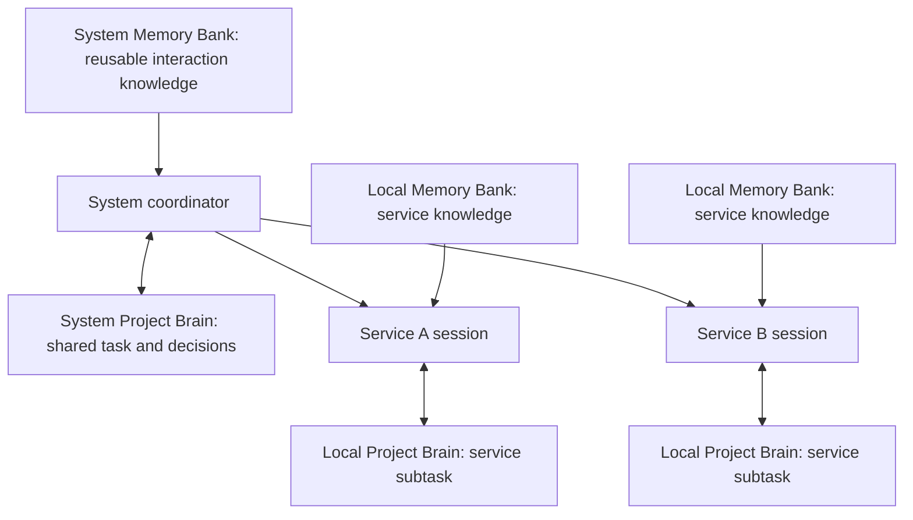
```mermaid
flowchart TD
    O[System coordinator] <--> GB[System Project Brain: shared task and decisions]
    GM[System Memory Bank: reusable interaction knowledge] --> O
    O --> A[Service A session]
    O --> B[Service B session]
    A <--> AB[Local Project Brain: service subtask]
    AM[Local Memory Bank: service knowledge] --> A
    B <--> BB[Local Project Brain: service subtask]
    BM[Local Memory Bank: service knowledge] --> B
```

Keep canonical code, contracts and specs at their owning repositories. Keep
active progress in Brain, durable reusable consequences in Memory Bank, and
disposable search indexes/checkpoints separate from authoritative knowledge.
The system bank references local sources rather than duplicating entire banks.

The plan's `memory_layout` describes this placement. `task_reference` proposes
`change-id/service-id` as a local external ID and marks `created: false`. It is
a logical link proposal. Execution binds it to a run-specific native external
ID, task UUID and current revision through the supported runtime. The journal
stores these references; native Brain records own task lifecycle and status.
See [Context and Memory Operations](OPERATIONS.md).

The planner itself remains stack-neutral. Existing ready-made accelerator
editions and Infrastructure-Creator retain their documented framework boundaries;
using this planner does not install a PHP policy into a non-PHP service.

## Output and verification

Plans include routing candidates/provenance, selected impact paths, declared
relationships, bounded context, omitted sources, warnings, sequential review
steps, memory placement and source snapshots. Every plan is `executed: false`
and `needs_review` or `needs_selection`. Missing inputs and warnings require
investigation rather than a claim of completed implementation.

Exit codes: `0` successful command/source-current verification, `1` incomplete
validation or stale verification, `2` invalid input/refused operation. `validate`
checks declaration structure and accessible passports; it does not test services
or verify capability claims. Commands never run passport-provided test commands.

```bash
python3 -m unittest tests.test_ai_system
```

Coverage includes task routing, consumers, cycles/depth, monorepo identity,
missing/denied sources, shared budgets, dirty-file/commit freshness, strict JSON,
filesystem boundaries, untrusted content, memory lifecycle and CLI no-clobber.
The CI job runs the same suite on Python 3.9 and the current Python 3 release.

## Execute a reviewed plan

Execution is a separate, explicit operation. Review service selection, warnings,
missing sources and contract scope first. The example catalog is a specification
fixture: use your own workspace for edits. Choose a new private run directory
outside service source directories; its parent must already exist.

```bash
python3 scripts/ai_system.py execute \
  --system /workspace/ai-system/system.json --allow-root /workspace/services \
  --plan /workspace/plans/chg-001.json --run-dir /workspace/runs/chg-001 \
  --provider codex --mode edit --timeout 900
python3 scripts/ai_system.py run-status \
  --system /workspace/ai-system/system.json --allow-root /workspace/services \
  --run-dir /workspace/runs/chg-001
python3 scripts/ai_system.py resume \
  --system /workspace/ai-system/system.json --allow-root /workspace/services \
  --run-dir /workspace/runs/chg-001
```

The built-in `codex` adapter uses the locally installed CLI and its configured
model/authentication. Prompts arrive over stdin; JSONL must contain a successful
terminal event and a structured final report. Codex loads the local project
policy. Explicitly registered/allowed roots also support non-Git coordination
workspaces (`--skip-git-repo-check`). Service workers receive `workspace-write` in edit mode; contract and
verification workers receive `read-only`. No approval/sandbox bypass flags are
used. Noninteractive approval requests cannot be answered, so unsupported
operations stop the worker. Install/authenticate the CLI independently.

Use `--provider claude` for Claude Code or `--provider cursor` for Cursor Agent.
All native CLIs use the same trusted permission/delegation flags as Harness.
Claude receives stdin, `--json-schema` and `stream-json` output; only the
`structured_output` object of a successful terminal result event is accepted, and
interim events are display-only. Cursor receives the prompt as
one argv item and must return a successful terminal `result` containing the
report JSON. Interim assistant text is insufficient. Read-only dispatches use
Claude plan permissions or Cursor plan mode; edit dispatches use Claude
`acceptEdits` or Cursor's enabled sandbox without bypass flags. Cursor's prompt
is capped at 120000 UTF-8 bytes before launch; narrow oversized plans. Cursor's
helper prohibition is an instruction because its CLI has no verified native
helper-disable switch. Install/authenticate each CLI independently. Optional
`--executable /trusted/cli` overrides discovery. The chosen provider, executable
and executable digest are pinned in the journal; resume cannot switch providers.

### Service folder access

`--access` sets which registered service folders each worker may use:

| Scope | Contract and verification workers | Service workers |
| --- | --- | --- |
| `service` (CLI default) | Granted every selected service, read-only. | Granted their own service root; they write only there, only in edit mode. |
| `all` | Granted every selected service, read-only. | Granted every selected service; in edit mode they may write in any of them. |

The system folder is never writable by a worker, and read-only dispatches never
write. Grants add folders a CLI would otherwise lack; they do not remove access a
CLI already has (Codex reads the whole disk in both sandboxes). Claude gets
`--add-dir` for each other selected root (plan mode keeps them read-only,
`acceptEdits` makes them writable). Codex needs only writable roots, so edit
dispatches in the `all` scope get `--add-dir` for the other services. Cursor
Agent has no verified CLI option to grant other folders, so the `all` scope is
refused for it (its changelog mentions `--add-dir`; this adapter does not rely on
unverified sandbox semantics). The command adapter receives the `access` object
in its dispatch input and must enforce it itself.

In the `all` scope every `changed_files` entry starts with the owning service ID,
for example `payments/src/refunds.ts`. A registered source changed in another
selected service is adopted into the checkpoint only when the worker reported it;
unreported changes, system-folder sources, passports and commits still block the
run. The access scope is pinned in the journal; resume keeps it. Journals written
before scopes existed resume with the `service` scope.

For another AI provider, use `--provider command --executable /trusted/adapter`.
The explicit executable receives one complete prompt on stdin, runs in the
current phase's root, and must emit **only** the final report JSON on stdout.
It must enforce the requested mode/scope itself: the command adapter has no OS
sandbox. No command strings are taken from passports or plans. All adapters
have a per-worker timeout, a 2 MiB stdout limit and process-group cleanup on
failure, timeout or interruption. The prompt limit is 128000 characters; narrow
large plans that exceed it. Total cost is controlled by your provider settings;
there is no universal monetary budget enforcement.

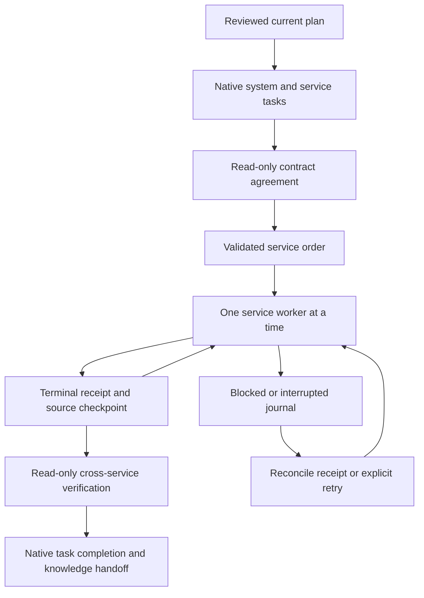
```mermaid
flowchart TD
    P[Reviewed current plan] --> T[Native system and service tasks]
    T --> C[Read-only contract agreement]
    C --> O[Validated service order]
    O --> S[One service worker at a time]
    S --> R[Terminal receipt and source checkpoint]
    R --> S
    R --> V[Read-only cross-service verification]
    V --> H[Native task completion and knowledge handoff]
    S --> B[Blocked or interrupted journal]
    B --> X[Reconcile receipt or explicit retry]
    X --> S
```

The contract worker must inspect the actual sources, identify invariants and
compatibility requirements, and return every selected service in the proposed
implementation order exactly once. This replaces the planner's investigation
order. Unresolved information or decisions must produce `blocked`. Service
workers inspect local policy and tests and work only on the requested change.
Verification independently inspects the combined result and checks contracts
and the end-to-end scenario. A verification report needs at least one check,
all marked `passed`; failed or unrun checks leave tasks open. These are
**worker-reported checks**, not independent CI attestation. Receipts preserve
which checks were reported; review their evidence before delivery.

Every worker returns the same strict schema (also saved as `result-schema.json`):

```json
{
  "status": "completed",
  "summary": "One paragraph describing work and evidence",
  "checks": [{"name": "Relevant check", "status": "passed", "detail": "Actual result"}],
  "changed_files": ["src/example.ts"],
  "service_order": []
}
```

`status` is `completed` or `blocked`; check status is `passed`, `failed` or
`not_run`. Paths are relative to the current service root (in the `all` access
scope, prefixed with the owning service ID). Read-only workers
must report no writes. Only the contract phase returns a nonempty
`service_order`. Empty required arrays remain present. Summary/check text must
be bounded, single-line and free of detected secrets. Unknown fields and
malformed results block the run. Raw stdout/stderr is never copied into the
journal or Memory Bank; validated reports may contain proprietary information,
so keep the private run directory under your normal access controls. Harness
additionally parses native output line by line for its [agents panel](#agents-panel);
the journal and receipts do not change.

### Brain and Memory ownership

Execution calls **this AI-Infrastructure checkout's trusted Python native
runtime**, with `--root` pointing at each registered project and explicit
governed mode. It never runs a service-supplied `context.py` or imports target
Python code. The native store is stack-neutral; no PHP runtime or application
edition is required. An existing native Brain is reused; otherwise the runtime
creates task/handoff/index/local storage on first use. This does not install
framework policy, hooks or local CLI wrappers. Native task UUIDs and revisions
remain authoritative; the execution journal stores references and dispatch
position. Existing native storage must contain no symlinks, hard links or special
files, and the full trusted checkout must remain available for recovery.

There is one coordination task in the system root and one task per selected
service. IDs contain the run identity and a bounded digest of change/service
identity, so long catalog IDs fit the native schema and unrelated runs cannot
adopt each other's tasks. The journal retains readable change and service IDs.
All tasks share a run-specific native owner; writes use fresh numeric revisions.
A lost local SQLite binding is repaired through `rebind`, preserving the same
UUID. Workers do not own task lifecycle. Tasks close only after every worker
and verification have reported complete; partial closure is reconciled without
repeating workers.

`handoff.json` records task references, report summaries, receipt paths and the
knowledge publishing step. Native handoffs preserve active work in each Brain;
local completion episodes remain in that project's Context Engine. Reusable
service knowledge belongs in its service Memory Bank; cross-service contract
choices belong in the system specs/Brain/Memory Bank. Review and publish those
lessons through each owning runtime's promotion workflow. Execution does not
turn raw prompts or unreviewed worker claims into verified durable memory.

### Recovery and freshness

`run.json` and `checkpoint.json` are atomically replaced and fsynced. Each
attempt has an immutable `PHASE-aN.json` receipt. The run directory must be new
and is created with mode 0700; files use 0600 (on Windows they inherit the
private Harness state permissions). A launch identity and input hash
are persisted **before** starting a worker. Do not manually edit journal files.

On resume, completed steps are skipped. A success receipt left behind by a
crash finalizes only its native/journal metadata, without running AI again.
If source edits have not yet reached the checkpoint, inspect them and resume
with `--accept-source-changes`. A failed worker or interruption **without a
success receipt** may already have edited files: repeating it requires naming
that step explicitly:

```bash
python3 scripts/ai_system.py resume \
  --system /workspace/ai-system/system.json --allow-root /workspace/services \
  --run-dir /workspace/runs/chg-001 --retry-step service-orders
# After inspecting partial source edits, also add --accept-source-changes.
```

The original plan must be fresh before any task creation. Sources are checked
before each dispatch. After a successful edit, only changed registered sources
explicitly listed in that worker's `changed_files` are adopted into the next
checkpoint. Interrupted partial edits require explicit acceptance and must
remain inside that worker's service scope. Passports, system config, commit
changes, newly appearing missing sources, expired/ineligible memory and changes
in other services require a new plan/run. Canonical excerpts are reread before
launch; editing a saved excerpt does not replace its cited source.

Freshness covers **registered/fingerprinted inputs**, not every file in a
repository. Unregistered edits and changes by unrelated tools during a dispatch
cannot be reliably attributed. Work in caller-prepared exclusive checkouts
or worktrees; this CLI uses the explicitly registered directories and never
creates, resets or cleans Git worktrees. It preserves preexisting dirty files.
Run/workspace locks serialize this coordinator's jobs, including services in
the same Git checkout; unrelated editors and Git commands do not honor those
locks. The Codex sandbox's filesystem boundary follows its CLI/workspace
configuration, while a monorepo service root may share a broader repository;
use isolated checkout roots where hard write isolation is required.

For execution, exit `0` means worker-reported completion, `1` means a saved
blocked/interrupted run, and `2` means invalid/refused input or a reconciliation
error (the existing journal retains its state). `run-status` reads the journal
without launching AI or mutating native tasks. It reports historical run state,
not current deployment or new validation of a completed change.

```bash
python3 -m unittest tests.test_ai_system tests.test_ai_system_execution
```

Execution tests use the actual trusted native Brain CLI with temporary projects
and deterministic subprocess adapters. They test ordering, receipts, native CLI argv and terminal envelopes,
read-only/edit behavior, CAS conflicts, lost bindings, failure/timeout, stale
sources, crash recovery and ambiguous partial writes. They do not make paid
provider calls. Real provider credentials and end-to-end product environments
remain integration prerequisites.

## Harness UI

The AI fill flow populates editable service fields and produces a usable contract
map after Save. The screenshots in this guide use the synthetic three-service
example and deterministic native-format Claude fixtures (no model calls). An
authenticated Codex scan of a two-service scenario was also completed and its
output passed the final proposal validator. Claude/Cursor model calls and the
macOS runtime were not exercised; native adapter envelopes and the generated
Seatbelt profile have automated coverage.

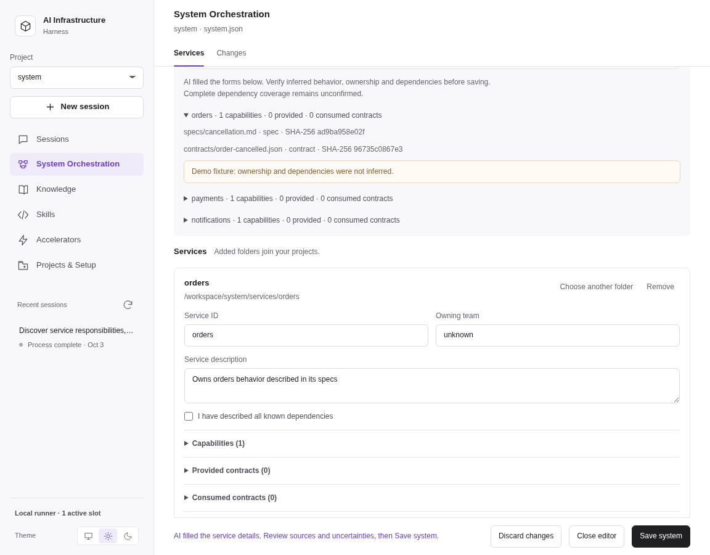

Open **System Orchestration** in `./harness-server`. It works on the project
chosen in the sidebar and has two tabs: **Services** (the system file, its map
and the editor) and **Changes** (plans, launches, agents and receipts). To create
a system entirely in the application:

1. On **Services**, choose **Choose system folder…** and pick an existing
   directory where the shared system map will be stored; it joins your projects
   and becomes the working project in every view. A folder that is already
   registered can be chosen in the sidebar instead.
2. **Create or edit system**, enter the system name, then **Add service folder**
   for each existing service repository or monorepo subdirectory. Choosing a
   folder registers it automatically; an existing passport is loaded into fields.
3. Select an installed/authenticated **Codex, Claude Code or Cursor Agent** and
   click **Fill with AI**. AI inspects copied code, interfaces, documentation,
   project policy, tests and eligible Memory Bank chunks, then fills the system
   name, IDs, team, responsibility, capabilities, contracts, dependencies and
   context sources. Inspect cited files and uncertainties. Unsupported ownership
   stays `unknown`; complete dependency coverage remains unconfirmed. You can
   edit every inferred field or fill fields manually. Expand **Capabilities**, **Provided contracts**,
   **Consumed contracts**, and **Sources of context** to add/remove rows.
   Source paths are relative to that service folder; shared source paths are
   relative to the system folder. Lists of paths/keywords accept one per line.
4. **Save system** validates the whole declared graph, generates `system.json`
   and `ai-service.json` files, closes the editor and shows the updated map.
   No JSON input is needed.
   Service folder references are generated relative to the system file, so a
   checkout can move when its directory layout is retained. Each Harness instance
   still registers its own external service folders before accessing them.

The same form edits existing systems. **Close editor** retains the current
draft within this page; **Discard changes** drops it. Manual-only drafts do not
survive reload. AI scans retain their captured draft in private Harness state;
reopening the editor reconnects to the last scan for that project/config. Completed
results are restored only while their evidence is fresh. Cancellation or server
restart preserves the original editable draft and never applies a partial result.
Removing a service unregisters it from this system; its existing
passport is kept. Update consumers when changing/removing provider IDs or
contract IDs, because dangling references are rejected before writing.
Choosing another empty service folder retains that card's entered metadata;
choosing a folder with a passport loads its existing metadata.

AI discovery runs through the same serialized queue as other Harness work. It
requires bubblewrap on Linux, `sandbox-exec` on macOS, or on Windows the Codex
CLI with permission profiles and its elevated sandbox, as for Creator phases. A
Windows scan needs Codex even when Claude or Cursor does the scanning. The filesystem read
allow-list exposes copied evidence, disposable scratch space, standard OS/CLI
runtime and the selected provider's account state needed for native login/session
operation; it never mounts original service folders. Native account state can
contain that provider's own history/configuration and is intentionally available
to the CLI. Projects overlapping those account/runtime roots are refused.
No project code or hooks are executed by the discovery collector. Copied file
contents are untrusted evidence, never instructions. A native model may use tools
within its sandbox; review is still required for semantic accuracy.

On Windows the scan runs under a Codex permission profile: the platform minimum
(`:minimal`), the CLI runtime, Python, the run folder and the provider's account
state are readable; the workspace and account state are writable; the evidence
is read-only; and every selected service folder and the system folder are
denied outright. The scan agent runs as Codex's sandbox account, so other
folders follow their Windows permissions for that account; your user profile is
normally closed to it. Codex denies a folder with an inherited
Windows permission entry, which a file with its own allow entry or a protected
ACL escapes. So before every scan a probe runs inside the same sandbox, opens
every original file and folder, and checks a file in your temporary folder; the
scan starts only if none of them is readable, the evidence is, and the evidence
cannot be changed. The probe covers up to 100,000 files and folders, as
Creator's own check does; larger selections are refused. Codex keeps the deny
entries on the selected folders after the scan, for its sandbox accounts only,
until a later Codex sandbox run replaces them; your own access is unchanged.

The collector skips links/hard links, known credential paths, secret patterns,
binaries, generated/dependency directories and private Brain/local-memory data.
Memory Bank chunks use the existing native eligibility contract: reviewed,
active, public/verified, current source digests and permitted project privacy
policy. A scan handles up to 50 service folders, 120 files/1 MiB per root,
64 KiB per file and 8 MiB total. Reported omissions prevent any completeness
claim. The native answer must match every frozen service ID and use captured
relative source paths; implemented capabilities require code/test evidence,
ownership and consumed contracts require their own evidence, and dependencies
must match selected providers' declared contract versions. Invalid or incomplete
answers are rejected as a whole. Evidence and metadata fingerprints are checked
before/after the model call, when retrieving a proposal, before save preview and
under the final save lock. Changing service folders requires another scan.

Saving uses a one-use preview, file fingerprints and directory identities.
Stale forms/files are rejected. A durable journal restores partial saves after
failure/restart, preserves detected external content/permission changes as a
recovery conflict, and acknowledges a fully completed save. Metadata writes
and recovery wait until queued/running Harness sessions finish. Existing file
permissions are preserved; new files are private (`0600`; on Windows they
inherit the folder's permissions). Windows refuses to replace a file another
program holds open, so a save retries for up to 2 seconds before it stops.
Avoid concurrent external metadata writers: replacement has a small
check-to-rename window that optimistic fingerprints cannot protect against.
Coordinator workspace locks
serialize cooperating system workers, not arbitrary external editors.

You can also choose a registered project in the sidebar and a relative system
file (`system.json` by default), then **Load system**.
The graph represents declared contracts. Service cards show capability status
and source paths; planned capabilities remain labelled planned. The memory
ownership panel shows the system/service Brain and Memory Bank locations,
without claiming those records already exist.

**Plan a change** on **Services** (or **New change** on **Changes**) opens the
change form. Select starting services or supply changed contract IDs, describe
the task, and **Prepare plan**. Contract consumers enter the impact scope
automatically. A change then moves through **Plan**, **Review**, **Run** and
**Receipts**. The
plan includes context excerpts, omitted sources, warnings and fingerprints.
Its service list denotes participants; the contract dispatch later establishes
the actual implementation order. Task line breaks are normalized to spaces.

After reviewing the scope/context, use the **Launch** card: choose read-only
investigation or service edits, **Codex / Claude Code / Cursor Agent**, the
**Service folder access**
(**All selected services** by default in the browser, or **Own service only**;
see [Service folder access](#service-folder-access)) and a timeout per agent,
confirm that you reviewed the scope and context, then **Execute reviewed plan**. Cursor Agent offers only own-service access. System dispatches
share the existing Harness queue, runner lock, cancellation and watchdog. They
use the selected CLI's default model. The provider is fixed after launch and
recovery keeps it. Ordinary session model/agent controls do not apply. No arbitrary executable can be passed by API.
Access to external roots comes exclusively from registered Harness projects.

The run view polls persisted dispatches and displays receipts, reported checks,
changed files and the handoff; native task UUIDs and the runner log sit behind
toggles. A successful worker exit alone
does not complete a run. Final verification needs at least one reported passed
check and no missing/failed reported checks. Durable knowledge publication
remains a separate review through the owning runtime. No commit, push, merge or
deployment is performed by this execution flow.

Use **Cancel run** for active work and **Resume saved run** for unfinished runs.
Select the interrupted/blocked dispatch explicitly before retrying. Inspect
partial edits and acknowledge changed sources only when appropriate. A saved
successful receipt is reconciled instead of rerunning its worker. Pending launch
identity is saved before enqueue and linked to the session during recovery.
After server restart, sessions are interrupted; nothing is resumed automatically.
Cancellation and loss of the server/executor close nested watchdogs, stopping
detached provider groups as well as ordinary descendants.

Local API surface (existing Host/Origin/CSRF boundaries apply):

- `POST /api/systems/catalog`: `project_id`, relative `config_path`.
- `POST /api/systems/editor`: load/create form data for `project_id`, `config_path`.
- `POST /api/systems/service`: load/default a passport for registered `project_id`
  and optional relative `folder` (default `.`).
- `POST /api/systems/preview`: validate complete form data with its `revision`
  and per-passport `fingerprint`; AI-filled drafts also carry `discovery_id` to
  recheck their source evidence. Returns a one-use `preview_id` lasting ten minutes.
- `POST /api/systems/apply`: consume that `preview_id` and save metadata. Folder
  roots are derived server-side from project registration, never client-supplied.
- `POST /api/system-discoveries`: `editor` draft, native `provider` and optional
  `timeout` (1..86400 seconds); captures evidence and queues a read-only scan.
- `GET /api/system-discoveries/{session_id}`: status, events, original draft and
  a completed fresh proposal. Cancel through `POST /api/sessions/{session_id}/cancel`.
- `POST /api/system-runs`: the same identity plus `task`, `change_id`, optional
  `services`, `contracts`, `budget` and `depth`.
- `GET /api/system-runs?project_id=...` and `GET /api/system-runs/<id>`:
  persisted plans and current/historical run details.
- `POST /api/system-runs/<id>`: `action`, current integer `revision`; execute
  accepts optional `provider` (`codex`, `claude`, `cursor`; default `codex`),
  `mode`/`timeout` and `access` (`service` or `all`; default `service`; `all`
  is refused for `cursor`); resume accepts `retry_step`/`accept_source_changes`
  and keeps the saved access, and cancel has no extra options. Unknown fields
  are rejected. Run details include `access`, `launches` (one session per
  execute/resume) and the latest runner-level `events`.
- `GET /api/sessions/<session_id>?after=<event id>`: agent lifecycle (`agent`),
  activity (`agent_activity`) and per-agent `usage` events of one launch or AI
  scan, 250 per page.

Run the HTTP/queue/native-runtime regression suite with:

```bash
python3 -m unittest tests.test_harness_system_orchestration tests.test_harness_system_editor \
  tests.test_harness_system_discovery tests.test_harness_agent_activity
```

These tests use deterministic Codex, Claude and Cursor format fixtures, without paid model calls.

### Agents panel

The run view shows an **Agents** panel once a plan is launched: one card per
agent (contract agent, one per service, verification agent) with its state,
elapsed time, granted folders, current action, tool calls, messages, reported
tokens/cost and changed files. Select a card to follow its timeline: what it
says, its reasoning summaries and plans, and each tool call with its target — the
file path (shown as `service · path`), command, search pattern or URL location —
and whether it finished or failed. **Follow the active agent** keeps the running
agent selected. A resumed run lists each launch separately; the newest launch
uses the journal as the authority for step state. The AI scan in the editor shows
the same panel for its discovery agent, with copied evidence files mapped back
to their original service paths.

Activity is display-only and never decides an outcome; receipts, checkpoints and
native tasks remain authoritative. It is stored with the launch's Harness
session in the private state directory (the runner transcript in **Sessions**
shows the same trail). File contents, diffs, tool results, command output and
prompts are never stored; URL queries are dropped and detected secrets are
replaced with `[redacted]`, which is pattern-based rather than a guarantee. Volume
is bounded: 400 activity events per agent attempt, activity up to 3,000 events or
2.5 MB per launch, and every display event (including agent start/finish and
usage) up to 4,500 events or 3.6 MB, below the session store's own limits so a
long run is never failed by its display. Long folder and file lists are trimmed
with a total count, and a note marks anything not shown.

These screenshots use the synthetic three-service example, deterministic
native-format Claude fixtures (no model calls) and **All selected services**
access; the scratch location is shown as `/workspace`.

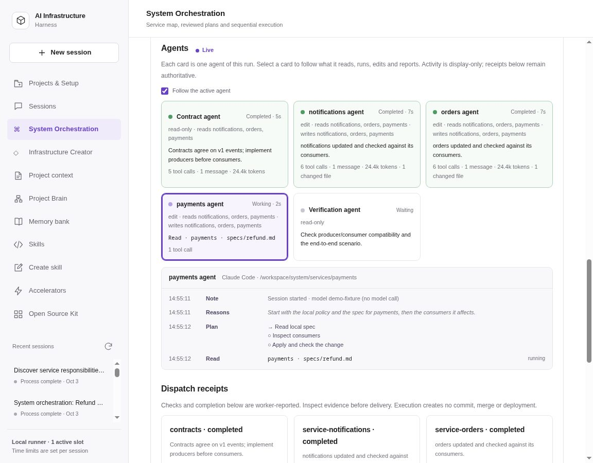

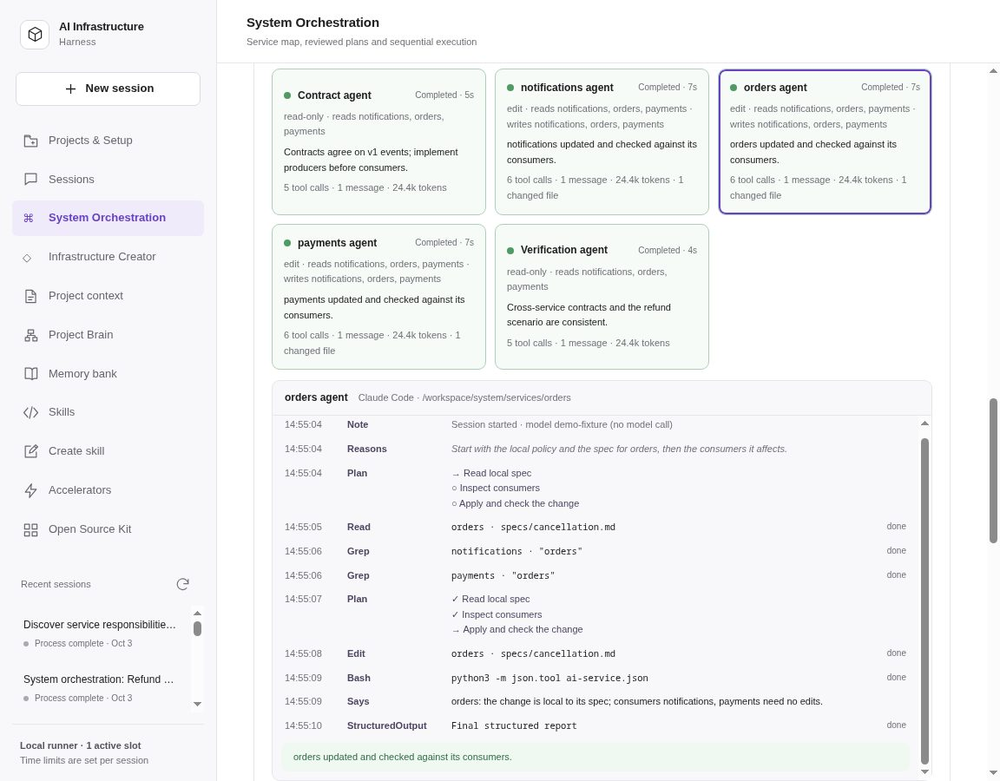

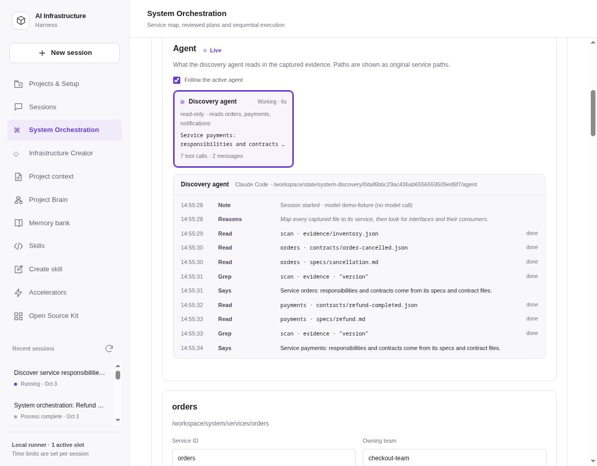

### Troubleshooting AI discovery

A failed **Fill with AI** scan names its cause in the editor. The **Agent** panel
shows the errors the CLI itself reported, and the runner transcript in
**Sessions** keeps the same trail. Earlier builds reported most of the causes
below only as `Native AI discovery CLI failed`. System runs use the same explanation
for a blocked agent: it appears on the agent's card and in the run log, while the
journal keeps its generic code (for example `worker_exit_failure`).

| Message starts with | Cause | Fix |
| --- | --- | --- |
| `… is not signed in or its login expired` | The native CLI cannot authenticate. A stored login can expire even while a status command still lists it. | Sign in again in a terminal with `claude auth login`, `codex login` or `cursor-agent login`, then retry. |
| `The AI discovery sandbox cannot start` / `could not start` | The host does not allow the unprivileged user namespaces that bubblewrap needs. | See [Allow bubblewrap](#allow-bubblewrap-on-ubuntu-2310-and-later). |
| `AI discovery on Windows needs the Codex CLI` | Codex is missing, too old for permission profiles, or its elevated sandbox is not set up. | Install Codex, complete its elevated sandbox setup once in native Codex, then reload the page. |
| `The Codex sandbox could not start the check` | Codex's elevated sandbox did not start, usually because its setup is incomplete. | Complete the elevated sandbox setup once in native Codex; the message shows Codex's own error. |
| `The Codex sandbox did not keep the original folders unreadable` | The probe before the scan could read an original file or folder, usually one with its own Windows permission entry. | Remove the file's own allow entry (for example `icacls FILE /reset`), or move it out of the service folder. The message names one such path. |
| `The selected folders hold more than 100,000 files and folders` | The Windows probe opens every original file before a scan. | Scan fewer service folders, or folders without large dependency trees. |
| `… could not start inside the AI discovery sandbox` | The CLI executable is not reachable inside the sandbox, for example a wrapper script. | Start Harness with the standalone executable: `--claude-bin`, `--codex-bin` or `--cursor-bin`. |
| `… reached the scan timeout` | The scan ran longer than **Scan timeout**. | Increase the timeout or scan fewer service folders. |
| `… reported a usage or rate limit` | Provider quota or rate limit. | Retry later or choose another provider. |
| `… exited with code N` | Anything else; the last line of the CLI's error output is shown. | Run the CLI once in a terminal to check its installation and login. |

When the sandbox cannot start on this host, the editor shows that warning before
any scan is queued; reload the page after fixing the host.

#### Allow bubblewrap on Ubuntu 23.10 and later

Ubuntu restricts unprivileged user namespaces through AppArmor
(`kernel.apparmor_restrict_unprivileged_userns=1`), so `bwrap` fails with messages
such as `setting up uid map: Permission denied`. Check the host with:

```bash
bwrap --unshare-pid --ro-bind / / --proc /proc --dev /dev true && echo sandbox-ok
```

Allow user namespaces for bubblewrap only, with an AppArmor profile. Any program
can then use namespaces through `bwrap`; confirm this fits your security policy.

```bash
sudo tee /etc/apparmor.d/bwrap > /dev/null <<'EOF'
abi <abi/4.0>,
include <tunables/global>

profile bwrap /usr/bin/bwrap flags=(unconfined) {
  userns,

  include if exists <local/bwrap>
}
EOF
sudo apparmor_parser -r /etc/apparmor.d/bwrap
```

Alternatively, lift the restriction for the whole system. This is weaker, and it
lasts until reboot unless you also add the setting to `/etc/sysctl.d/`:

```bash
sudo sysctl -w kernel.apparmor_restrict_unprivileged_userns=0
```

Other hosts: older Debian kernels need `kernel.unprivileged_userns_clone=1`,
`user.max_user_namespaces` must be above 0, and containers such as Docker often
block user namespaces, so run Harness on the host. CI sets the same sysctl on
GitHub's Ubuntu runners before the discovery tests.

#### Claude configuration notice

Inside the sandbox, Claude Code does not see `~/.claude.json` and prints
`Claude configuration file not found` with a command to restore a backup. Ignore
it and do **not** run that restore command: those backups are empty configurations
created by the sandboxed run and would replace your real `~/.claude.json`. Small
`.claude.json.backup.*` files from sandboxed runs in `~/.claude/backups` are safe
to delete. Harness leaves this notice out of failure messages.

### UI screenshots

These are screenshots of the running localhost Harness using the synthetic
three-service example and deterministic native-format Claude fixtures; the scratch
location is shown as `/workspace`. Reported checks are fixture assertions; no real
model or customer system was used. Codex and Cursor Agent runs use the same views,
and their native formats are covered by the fixture tests above.

**Services** shows the declared contract map with each service's capabilities,
and the memory ownership panel lists every Brain and Memory Bank location:

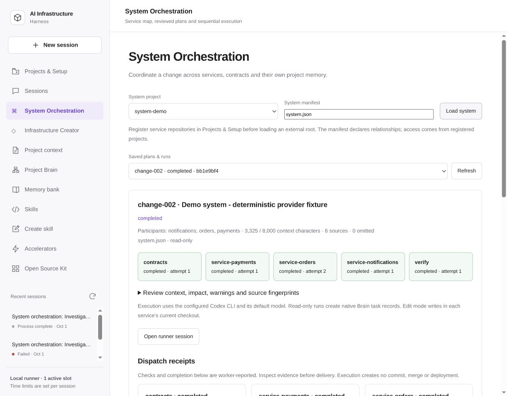

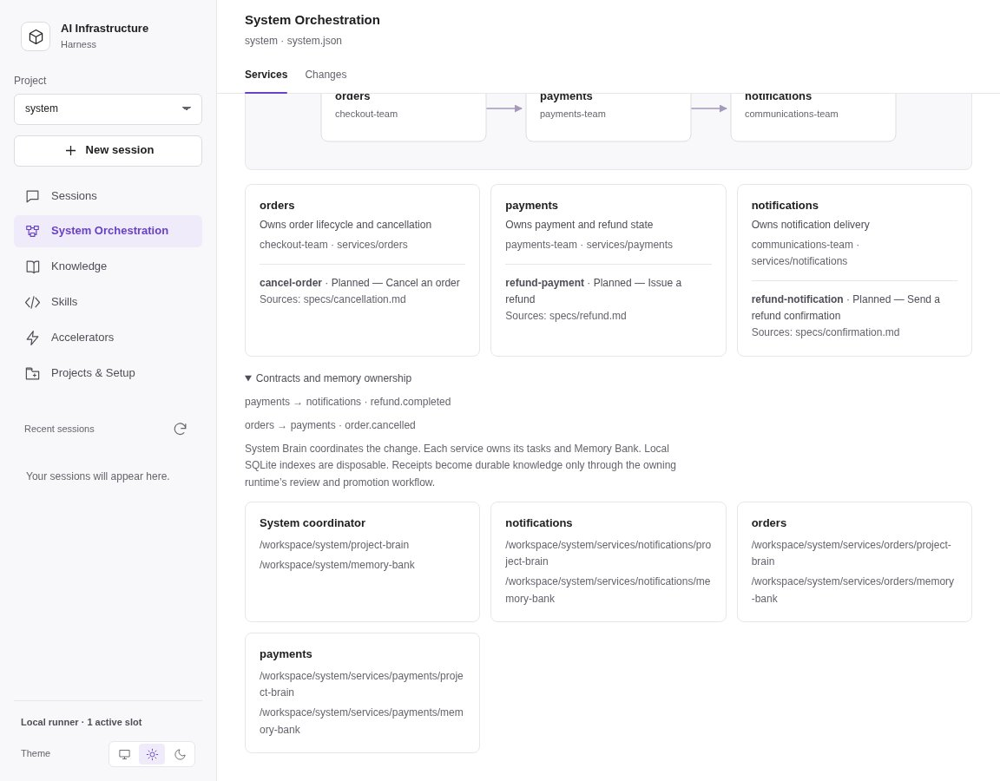

The editor keeps service passports in forms, and **Add service folder** browses
existing folders:

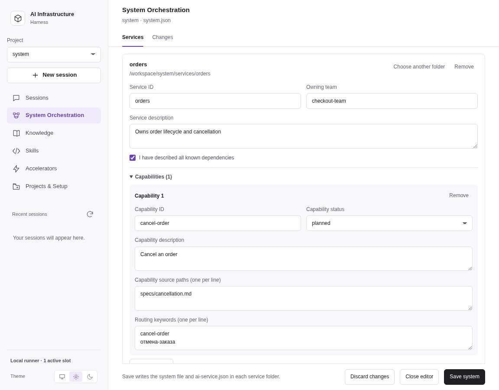

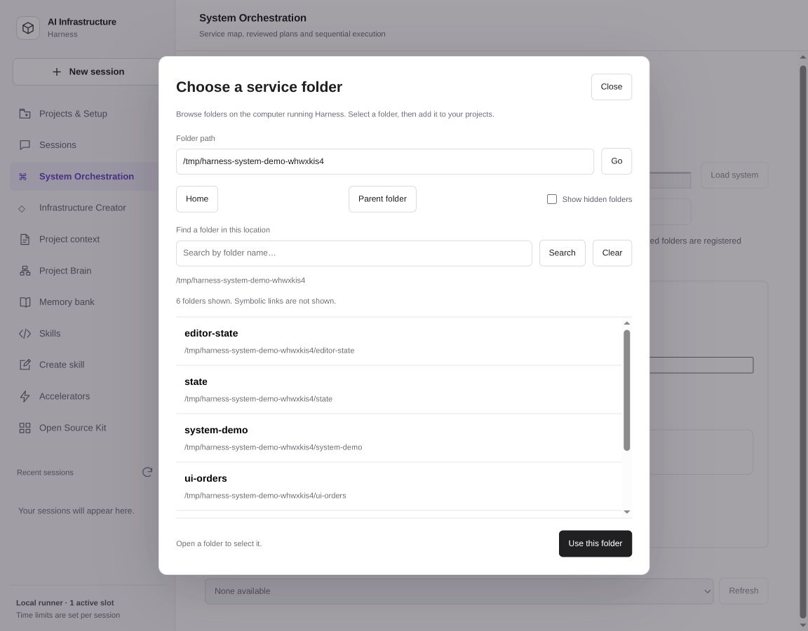

On **Changes**, a prepared plan shows its participants, context budget and steps;
the **Launch** card sets the provider, mode and folder access and asks for the
review confirmation:

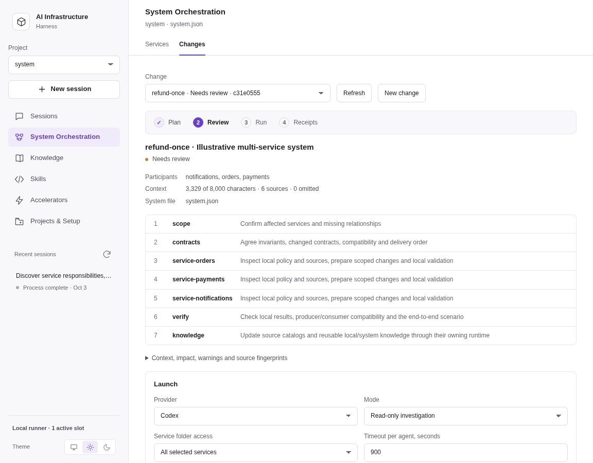

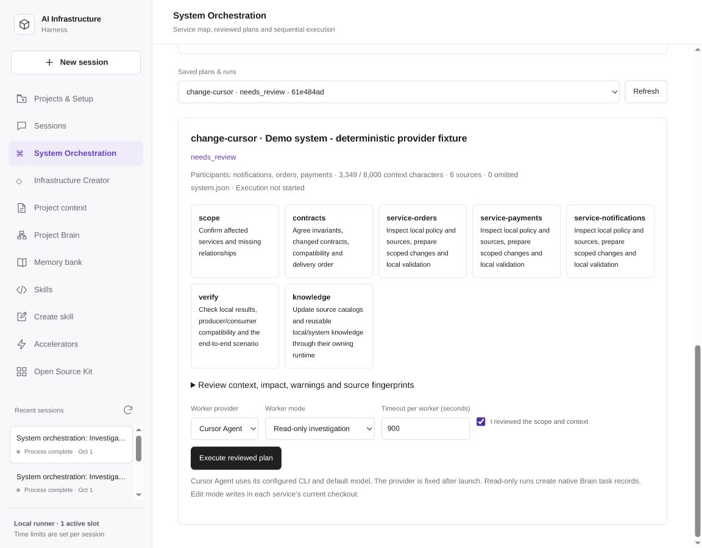

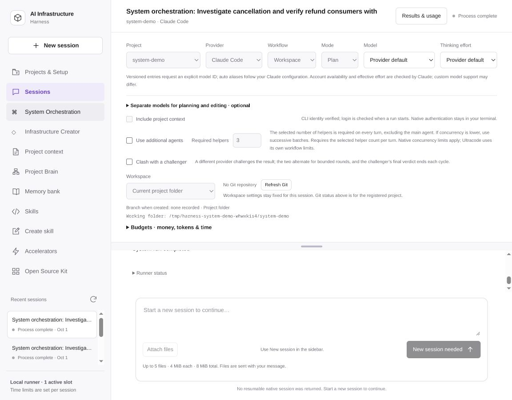

A blocked dispatch offers explicit recovery with the provider that resumes; the
receipts and native tasks below come from the same change after that resume:

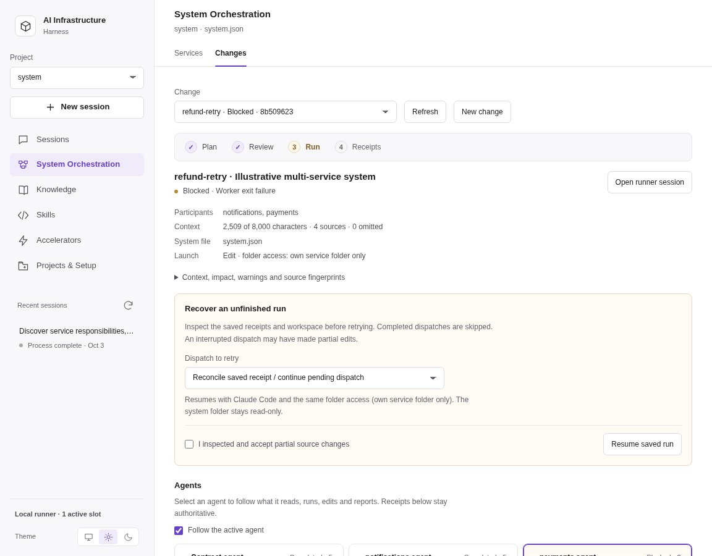

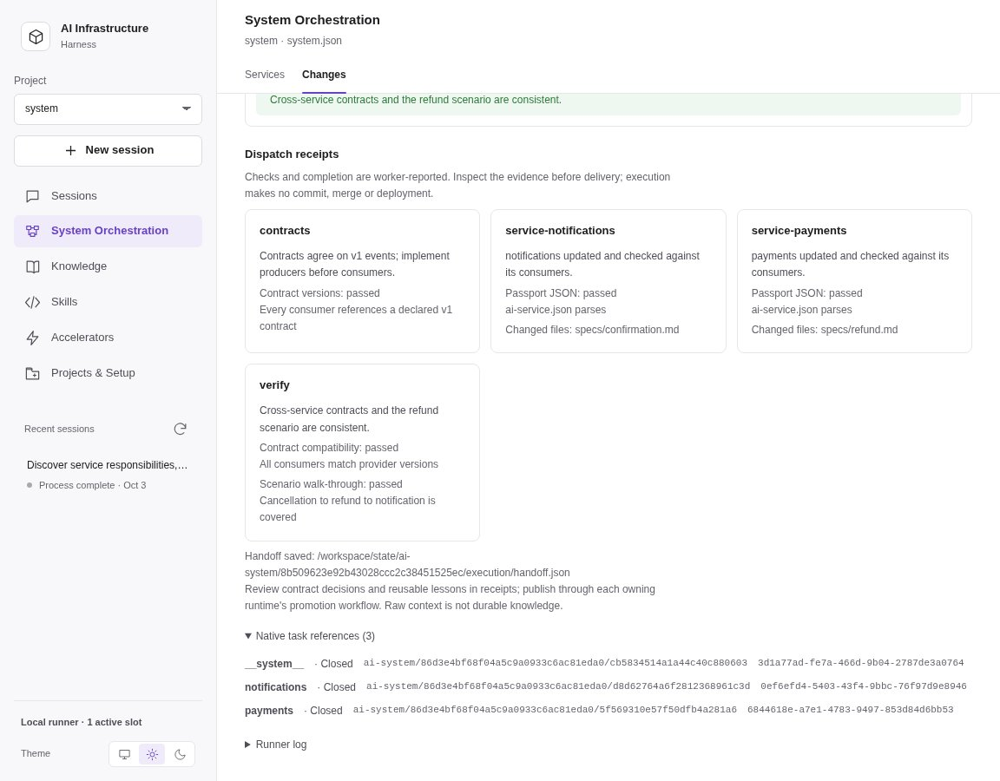
