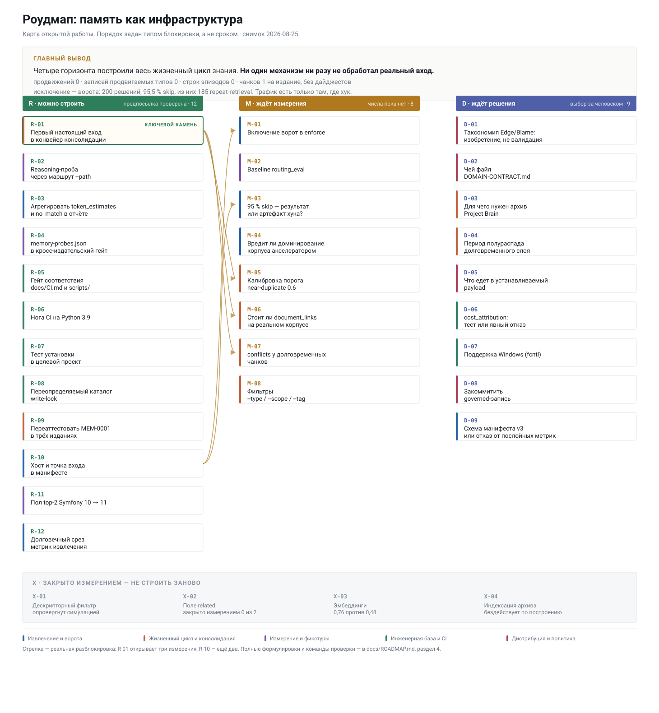

<!--
Документ перестроен 2026-08-25 после реализации горизонтов H1–H4.
Структурный снимок после интеграции WordPress-редакции и капитального ремонта
контура памяти повторно проверен 2026-08-31.

Предыдущая версия была планом, написанным до реализации. Сверка каждого её
пункта с кодом показала, что устарели 5 из 7 пунктов H1, 8 из 8 H2, 6 из 6 H3
и 6 из 6 H4. Причина не в небрежности автора, а в структуре: документ не имел
способа отличить проверенное утверждение от предположения и не имел способа
устареть заметно.

Эта версия построена от обратного. Каждое утверждение о состоянии
сопровождается командой, которая его перепроверяет. Каждый открытый пункт
назван тем, что его блокирует, а не оценкой трудоёмкости. Ссылки даются на
символы, а не на номера строк: номера строк были источником гнили номер один.

Структурные числа получены на ветке integration/roadmap-and-wordpress по
текущему рабочему дереву. Скользящий снимок манифестов обновлён 2026-08-31:
LOCAL_MANIFEST_RETENTION = 200, окно перезаписывается за дни. Исторические 200
манифестов имеют версию 2; исправленный runtime пишет версию 3, поэтому старое
окно нельзя использовать для калибровки новых ворот.
-->

# Роудмап: память как инфраструктура



## 0. Как читать этот документ и как его поддерживать

Четыре правила. Они и есть главное отличие от предыдущей версии.

1. **Утверждение о состоянии обязано нести проверку.** Не «в коде есть X», а
   команда, после которой видно, есть X или нет. Если проверки нет — это не
   утверждение, а предположение, и ему место в разделе 3, а не в разделе 2.
2. **Пункт называется тем, что его блокирует, а не размером.** Оценки S/M/L в
   прошлой версии не пережили реализацию (пункт «S» оказался M). Очередь
   определяет не трудоёмкость, а тип блокировки: `R` — можно строить, `M` —
   ждёт измерения, `D` — ждёт решения человека, `X` — закрыто.
3. **Ссылки на символы, не на строки.** `context_retrieval.py::gate_decision`
   переживает правку соседней функции; `context_retrieval.py:1959` — нет. В
   прошлой версии номера для `context.py` были завышены на ~73 ещё до начала
   работ.
4. **Отрицательный результат — это результат.** Опровергнутый механизм не
   исчезает из документа, а переезжает в раздел 6 вместе с числом, которое его
   опровергло. Иначе он будет предложен заново.

Правило поддержки: **пункт не пишется, пока его предпосылка не проверена
командой.** Процедура — в разделе 8.

Все команды `memory-bank/scripts/context.py` ниже выполняются из корня
конкретного издания; команды `scripts/*.py` — из корня монорепо.

---

## 1. Главный вывод: полный цикл памяти теперь проходит end-to-end; открыта эксплуатационная калибровка

Это главный результат ремонта и ответ на вопрос «память вообще отрабатывает?».

**Да. Теперь не только чтение, но и весь жизненный цикл проходит через
публичный CLI:** реальный файл-источник → governed finding → подтверждение →
terminal state → автоматическое продвижение → `MEM-*` с дайджестами →
завершение задачи → эпизод → извлечение нового чанка из другой задачи. Тест не
вызывает внутренние функции напрямую: он поднимает временный Git-репозиторий и
гонит те же команды `context.py`, которыми пользуется установленное издание.
Этот сценарий прошёл во всех четырёх готовых изданиях.

После этого тот же путь проверен на **точной изолированной копии текущего
Bauherrenmappe HEAD `d2aced3`**. В проект установлена исправленная
Symfony/Codex-поверхность; настоящий `UserPromptSubmit`-hook выбрал проектный
`AGENTS.md`, `Stop`-hook записал чекпоинт и автоматически продвинул проверенный
contact-directory finding, а prompt другой задачи выбрал новый source-digested
`MEM-*`. Исходный checkout Bauherrenmappe не изменялся. Это закрывает `R-01` как
client-codebase proof; длительная production-калибровка остаётся измерением, а
не недостающей реализацией.

**Чтение и доставка реальных промптов уже наблюдались.** Хук
`UserPromptSubmit` передаёт промпт в `working-memory-read.sh`, тот запускает
`refresh --query` и возвращает ограниченную Task Capsule. Исторический локальный
срез Symfony на 2026-08-31 содержит 200 манифестов v2, 193 непустых отбора и
200 решений `shadow`:

```bash
python3 memory-bank/scripts/context.py retrieval-report --json
```

В `shadow` решение `skip` — только телеметрия; контекст удерживается лишь в
`enforce`. Манифест доказывает отбор и доставку, но не может доказать, что
модель использовала каждый фрагмент в рассуждении.

**Автоматический чекпоинт тоже обрабатывает реальный Git-delta.** При этом
ремонт обнаружил важный дефект качества входа: `--untracked-files=all`
разворачивал вложенные vendor/cache-деревья и однажды дал **11 081 путь**.
Теперь пути edition-relative, runtime-мусор исключён, а неотслеживаемые каталоги
схлопываются. На текущем грязном Symfony-дереве тот же сбор даёт **22 пути**,
включая `.claude/worktrees/` и `Task/app/` по одному разу.

**Долговременный путь теперь доказан тестом и Bauherrenmappe-прогоном, но
основное рабочее дерево AI-Infrastructure намеренно не засорялось
демонстрационной записью.** Поэтому его текущий `status --json`
по-прежнему показывает `promotable: 0, blocked: 0, applied: 0, chunks: 1` и
`episodes: 0`. Это состояние данных, не состояние кода. Единственный
существующий `MEM-0001` переаттестован во всех четырёх изданиях; `bank-audit`
теперь возвращает пустые `source_changed`, `overdue_review`, `undigested` и
`duplicates`.

Ремонт изменил и трактовку старой доли `skip`. Исторические **190 из 200**
решений были записаны v2 до исправления repeat-signature: она не учитывала
изменение содержимого, ревизию задачи, хост и точку входа. Эту цифру можно
сохранить как снимок, но нельзя использовать для включения `enforce`.
Исправленный v3-манифест разделяет `host`, `entry_point`, режим, токены и
локальные эпизоды; следующий шаг — накопить новое v3-окно и проверить ложные
`skip` на golden-пробах.

Итого: **сломанный механизм больше не является блокировкой.** Открытая работа —
production-наблюдение на серии реальных задач, калибровка и решения, которым
действительно нужны данные или выбор человека, плюс пять проверенных
инженерных пунктов `R-02`, `R-05`, `R-06`, `R-11`, `R-12`.

---

## 2. Проверенное состояние на 2026-08-31

Всё в этом разделе получено прогоном, а не прочтением.

### 2.1. Ядро

| Что | Значение | Проверка |
|---|---|---|
| Модулей ядра | **5**: `brain_runtime.py`, `context.py`, `context_retrieval.py`, `telemetry.py`, `validate.py` | `git ls-files \| grep -E 'memory-bank/scripts/.*\.py$'` |
| Строк на издание | 11 836 (+41 в `project-brain/scripts/validate.py`) | `wc -l <edition>/memory-bank/scripts/*.py` |
| Копий, побайтово идентичных | **5** — четыре готовых издания плюс ассет генератора | `python3 scripts/asset_parity.py --check` и `context.py parity --cross-edition` |
| Подкоманд CLI | **36** | `python3 memory-bank/scripts/context.py --help` |
| Тестов | **2652** — 2520 в девяти сьютах (53 файла), 132 репозиторных (8 файлов) | прогон каждого `test_*.py` |
| Джобов CI | **8**: tests, parity, mirrors, infrastructure-creator-reliability, installation, lint, changelog, links | `.github/workflows/ci.yml` |
| Инструментов в `scripts/` | 11 Python + 1 shell; **9 запускаются напрямую в CI**; scorer/fixtures `routing_eval.py` тестируются без модели, `cost_attribution.py` — вне CI | `.github/workflows/ci.yml`, `scripts/README.md` |

Зависимость, о которой стоит помнить при любой правке ядра: пять модулей
обязаны оставаться побайтово идентичными в пяти местах, и это единственная
причина, по которой правка одного файла превращается в правку пяти плюс
регенерацию зеркал. Гейт — `parity --cross-edition` плюс `asset_parity --check`.

### 2.2. Извлечение и ворота

| Что | Значение | Проверка |
|---|---|---|
| Режим ворот по умолчанию | `shadow` — решают и записывают, не действуют | `context_retrieval.py::RETRIEVAL_GATE_DEFAULT` |
| Словарь причин | `no-relevant-match`, `empty-after-filter`, `repeat-retrieval`, `task-changed`, `new-selection`, `gate-off` | `context_retrieval.py::gate_decision` |
| Версия манифеста | **3** (`host`, `entry_point`, `local_episode_count`, токены эпизодов); v1/v2 продолжают строго валидироваться | `project-brain/schemas/retrieval-manifest.schema.json`, `brain_runtime.py::validate_repository` |
| Repeat-baseline | изолирован по task + host + entry point; сигнатура включает query, path + source hash, task revision и локальный эпизод | `context_retrieval.py::_retrieval_signature`, `_retrieval_baseline_key` |
| Ладдер капсулы | 2 procedural / 3 semantic / 1 episodic | `context_retrieval.py::CAPSULE_*_LIMIT` |
| Локальный эпизод | ищется до решения ворот, входит в лимит и токены; manifest хранит только count/tokens, не id/body | `context_retrieval.py::retrieve` |
| Обратный индекс | таблица `document_links`, команда `links`, флаг `retrieve --path` | `context.py links --path <путь>` |

**Осторожно с двумя формулировками.** `selection_identical_to_previous_turn` —
это булев сигнал внутри `gate.signals`, а не причина; группировка отчёта по
такому имени вернёт пустоту. Элементы `selected[]` по-прежнему несут
`category`, а не `layer` — поэтому «доля ходов с пустым procedural-слоем»
сегодня не вычисляется и требует следующей версии схемы либо явного отказа от
этой метрики (`D-08`).

### 2.3. Жизненный цикл факта

| Операция | Состояние | Команда |
|---|---|---|
| add | исполняем | `brain-create`, `promote-apply` |
| noop по содержанию | исполняем, блокирует продвижение | near-duplicate в `apply_promotion` |
| eligibility при apply | повторно проверяет type/state, authority, privacy, content и freshness; outcome связан с review mode | `brain_runtime.py::promotion_eligibility_error`, `validate_promotion_record` |
| retire | исполняем | `bank-retire --id --valid-to` |
| переаттестация | исполняема | `bank-reverify --id` |
| аудит расхождений | исполняем | `bank-audit --json` |
| overwrite / delete | по-прежнему ручная правка | — |

Полный CLI-сценарий жизненного цикла входит в `AutomaticWorkingMemoryTest` и
прошёл в каждом издании. `bank-audit` существующего банка сегодня возвращает
`source_changed: 0`, `overdue_review: 0`, `undigested: 0`, `duplicates: 0`:
`MEM-0001` переаттестован и теперь имеет дайджест каждого источника.

### 2.4. Измерения, которые существуют

| Актив | Содержимое | Где |
|---|---|---|
| `memory-probes.json` | 12 проб на каждое из четырёх изданий: 3 recall / 3 update / 3 restraint / 3 reasoning; побайтовая идентичность входит в cross-edition parity | `<edition>/project-brain/tests/fixtures/` |
| `skill-routing-golden.json` | полы top-2: Laravel 12/15, Symfony 10/16, PHP Core 13/14, WordPress 17/18 | там же |
| `routing.json` | 13 / 13 / 11 / 15 кейсов, по 2 restraint на издание | `<edition>/.agents/evals/` |
| policy lock | sha256 промпт-поверхности + модели агентов, **5 поверхностей**: четыре издания и Infrastructure-Creator | `<component>/.accelerator-policy-lock.json` |
| Отрицательные результаты | эмбеддинги; указатели навыков; 0 из 2 по общему источнику | `docs/CONTEXT-AND-MEMORY.md` |

Чего **нет**: baseline `routing_eval` — каталог `install/policy-lock/` не
существует, потому что прогоны модели платные и не запускались.

### 2.5. Что проверено на реальном проекте

Проверяемый client codebase — текущий Bauherrenmappe на Symfony 6.4 / PHP 8.4:
HEAD `d2aced3`, 547 отслеживаемых файлов, 270 PHP-файлов в `src`. Все изменения
для прогона внесены только в изолированный worktree; исходный checkout остался
нетронутым.

Этот опыт теперь закреплён автоматическим clean-install smoke: **4 издания × 3
инструмента = 12 установок**. Каждая установка сохраняет чужой `.gitignore`,
индексирует принудительно отслеживаемый источник под запрещающим `*.md` и
`/docs/`, запускает `start`, создаёт source-backed finding, переиндексирует и
доказывает связь командой `links --path`.
Отдельный `ProjectBrainRuntimeTest` доказывает диагностический случай, когда
markdown-паттерн целиком потерян из-за `.gitignore`, и требует
`pattern-all-git-ignored`.

Отдельный client-codebase smoke выполнен на изолированном worktree текущего
Bauherrenmappe (`d2aced3`). Codex-установка скопировала 183 файла с безопасным
merge существующего `AGENTS.md`; индекс увидел 99 документов. Фактические hooks
дали следующий результат:

- `UserPromptSubmit` записал manifest v3 с `host=codex`,
  `entry_point=refresh`, `query_source=prompt` и выбрал Bauherrenmappe
  `AGENTS.md`;
- `Stop` при `flush_after=1` поднял ревизию задачи и сохранил checkpoint на 14
  схлопнутых путей;
- verified + resolved finding автоматически стал
  `MEM-20260831-44d3b2b6-*` с `approved-without-review`;
- другая задача получила этот `MEM-*` через тот же prompt-hook; `links --path
  AGENTS.md` вернул и чанк, и completion-event;
- повтор в `shadow` дал `repeat-retrieval`, тот же повтор в `enforce` был
  удержан, а после изменения задачи контекст снова был доставлен;
- отдельная episodic-проба была доставлена как `local_episode_count=1` и заняла
  79 токенов; `bank-audit` остался чистым.

Свежий open-source checker из ветки Артёма проверен отдельно: `--select all`
создаёт `.kit3-manifest.json` с 15 `install_guidance`, но **не устанавливает
память и вообще не выполняет эти команды**. В проверенном снимке 13 вариантов
не reviewed, 2 имеют known risks, все 15 unpinned; такой manifest — dossier для
выбора, не команда «установить всё».
Сьют ветки проходит **64/64**, хотя README всё ещё обещает 52. У manifest нет
формальной проверки схемы, а переданный пользователем `pinned_ref` не
разрешается и не сверяется с установленным состоянием. Поэтому до формулировки
«аудит того, что установлено» нужен либо executor с записанным результатом и
разрешённым ref, либо более узкое обещание в документации.

Два дефекта, найденных прежней client-установкой и **починенных**: промоушен терял цитаты записи
(цепочка «чанк → запись → документ» рвалась, и обратный индекс был для неё
бездействующим); и полностью git-ignored дерево документов пропадало из индекса
молча. Оба описаны в `docs/CONTEXT-AND-MEMORY.md` и в корневом `CHANGELOG.md`.

Один факт остаётся **не откалиброванным**: в текущем Symfony-индексе **94 из
100** документов — файлы самого акселератора. `R-07` уже доказал, что runtime
после установки работает; `M-04` должен измерить, вредит ли это доминирование
ответам на проектные вопросы.

### 2.6. Интеграция WordPress после H1–H4

Четвёртое готовое издание живёт в `Cms/wordpress` (версия 2.0.0). Простой merge
оставлял десять расхождений с каноническим ядром; интеграция синхронизировала
пять core-модулей, хуки, схемы, общие тесты, зеркала, policy lock и inventory.
Текущий inventory: **597 устанавливаемых и 23 исключённых файла**.

WordPress получил собственные измерения маршрутизации: lexical top-2 **17/18**
и 15 model-eval кейсов, включая 2 restraint. 17/18 нельзя сравнивать напрямую
с Symfony 10/16: корпуса разной сложности и не откалиброваны друг относительно
друга. Это также не model baseline и не проверка на живом WordPress-проекте,
поэтому `M-02` остаётся открытым. Runtime-часть `R-07` закрыта матрицей из 12
чистых установок.

---

## 3. Принципы

Пять правил прошлой версии сохраняются; два переформулированы по итогам
реализации, один добавлен.

**П1. Три решения независимы.** «Что это» (формат), «как найти» (извлечение),
«как поддерживать» (жизненный цикл) — отдельные решения, и улучшение одного не
оправдывает бездействия по другому. *Осталось верным.*

**П2. Цель ворот — экономить смещение, а не токены.** Неверный указатель дороже
отсутствующего. Старое v2-окно давало `skip` в 95,0 % ходов, но его
repeat-signature оказалась неполной; цифра не доказывает экономию и не является
основанием для `enforce`. Проверка начинается заново на v3 после исправления
content hash, task revision и изоляции по host/entry point.

**П3. Содержательный `noop` должен быть дешёвым и наблюдаемым.** Ветка
реализована и полный happy path доказан, но порог near-duplicate ещё не
калибровался на производственных кандидатах. Утверждение о частоте и качестве
`noop` остаётся гипотезой (`M-05`).

**П4. Разделение «не знаю» и «выдумал» — самое дешёвое улучшение оценки.**
*Осталось верным и реализовано для наблюдаемого сигнала:* v3 различает
`no-relevant-match` и `empty-after-filter`, а `retrieval-report` агрегирует
послойный `gate.signals.no_match`. Это не классификатор «выдумал»; это честная
граница того, что система знает о собственном поиске.

**П5. Механизм строится только после измерения.** *Оказался несущим.* Именно он
остановил три механизма, которые иначе были бы построены впустую: дескрипторный
фильтр (опровергнут симуляцией), поле `related` (измерение перенаправило работу
на обратный индекс), затухание чанков (измерение говорит против пункта как он
написан). Правило работает и в обратную сторону: **отсутствие числа — это
блокировка, а не повод строить на всякий случай.**

**П6 (новый). Стенд — это история, которую разработчик рассказывает себе.**
Тогдашний зелёный набор тестов не нашёл ни один из двух дефектов, найденных за
полчаса на реальном проекте: первый — потому что фикстура описывала форму,
которой конвейер не производит; второй — потому что ни один тест не ставил
издание в проект с чужим `.gitignore`. **Перед сдачей издание ставится в
проект и по нему прогоняется runtime-цикл.** Матрица clean-install закрепляет
это правило для 12 комбинаций издание × инструмент; production-проверка
на Bauherrenmappe закрыла единичный client proof. Серия production-задач теперь
нужна для калибровок `M-05`, `M-06` и `M-07`, а не для доказательства, что
механизм вообще работает.

---

## 4. Работа после ремонта

Порядок внутри групп — по тому, что разблокирует наибольшее число других
пунктов, а не по трудоёмкости.

### 4.1. `R` — предпосылка проверена: 5 открыто, 7 закрыто

Закрытые 2026-08-31 пункты оставлены рядом с очередью, чтобы состояние было
проверяемым и они не появились снова как «ещё не сделанные».

**R-01 — ЗАКРЫТО. Подтвердить полный цикл на знании клиентского проекта.**
На изолированном worktree Bauherrenmappe реальный Codex prompt-hook прочитал
проектный контекст, Stop-hook записал checkpoint и автоматически продвинул
verified/resolved finding, `complete` создал event + episode, а hook другой
задачи выбрал новый `MEM-*`. В Bauherrenmappe smoke счётчики выросли на
`applied +1`, `chunks +1`, `episodes +1`; `bank-audit` чист. Исходный checkout
не менялся. Это разблокирует измерения `M-05`, `M-06`, `M-07`, но одного
кандидата недостаточно для их калибровки.

**R-02. Дать категории `reasoning` то, что она должна измерять.**
Три её пробы сегодня проходят по лексическому совпадению слов, то есть не
измеряют вывод из связи. Механизм уже есть: на фикстуре с общим источником
маршрут `--path` даёт 2 из 2, а без него — 0 из 2. Добавить пробу этой формы и
утверждать оба исхода.
Проверка: `test_runtime.MemoryProbeTest`.

**R-03 — ЗАКРЫТО. Агрегировать токены и `no_match` в
`retrieval-report`.** Отчёт теперь возвращает percentiles по каждому полю
`token_estimates`, послойные счётчики `gate.signals.no_match`, отдельные
`would_skip`/`withheld` и slices по mode/query_source/host/entry_point.
Проверка: `RetrievalReportTest`. Доля пустых слоёв по-прежнему не вычисляется,
потому что `selected[]` не несёт `layer`; это `D-08`.

**R-04 — ЗАКРЫТО. Удержать `memory-probes.json` кросс-издательским
гейтом.** Фикстура включена в `CROSS_EDITION_CORE_MANIFEST`;
`skill-routing-golden.json` и `routing.json` не включены, потому что законно
различаются. Проверка: `context.py parity --cross-edition` ×4 и
`asset_parity --check`.

**R-05. Гейт соответствия документации и конфигурации.**
`docs/CI.md` разошёлся с `ci.yml`, `scripts/README.md` — с содержимым `scripts/`,
и ничто это не ловит: `check_links.py` проверяет разрешимость ссылок, а не
полноту описания. ~40 строк stdlib по образцу `check_stabilization.py`.

**R-06. Нога CI на Python 3.9 для одного издания.**
Сегодня 3.9 проверяется только на сьюте генератора, хотя ядро заявляет ту же
поддержку. Сьюты изданий побайтово идентичны, поэтому одной ноги достаточно.
Статический просмотр показывает, что синтаксиса 3.10+ в ядре нет — то есть нога
скорее всего зелёная сегодня, и именно поэтому её надо закрепить, пока это
не перестало быть правдой молча.

**R-07 — ЗАКРЫТО. Расширить clean-install smoke до runtime-цикла.**
`CleanInstallTest.test_every_edition_and_tool_clean_install` проверяет 12
комбинаций: 4 издания × 3 инструмента. После установки запускаются `start`,
source-backed `brain-create`, повторная индексация и `links --path`; чужой
`.gitignore` сохраняется, а принудительно отслеживаемый markdown под его
запрещающими паттернами остаётся индексируемым. Диагностика полностью
потерянного паттерна отдельно покрыта `ProjectBrainRuntimeTest`. Проверка
установки: `tests.test_installation`, 18 тестов.

**R-08 — ЗАКРЫТО. Переопределяемый каталог write-lock.**
Тесты используют собственный временный `SUBAGENT_WRITE_LOCK_DIR` и больше не
удаляют живой `/tmp` lock. Явный override обязан быть абсолютным существующим
write/searchable-каталогом. Невалидный override блокирует нового writer, но не
съедает completion journal уже завершённого read-only агента. Проверка:
`SubagentDispatchHookTest` и `SubagentGateHookTest`.

**R-09 — ЗАКРЫТО. Переаттестовать `MEM-0001` в четырёх изданиях.**
Каждый чанк имеет текущие `source_digests`, `last_verified: 2026-08-31` и
`review_after: 2027-08-31`. `bank-audit --json` во всех изданиях возвращает
пустые `source_changed`, `overdue_review`, `undigested` и `duplicates`.

**R-10 — ЗАКРЫТО. Записывать хост и точку входа.**
Манифест v3 хранит `host` и `entry_point`; Claude/Codex/Cursor-хуки передают
свой фактический хост, repeat-baseline изолирован по task + host + entry point,
а отчёт строит slices с mode и query_source. v1/v2 продолжают валидироваться.
`M-01` и `M-03` теперь ждут новое v3-окно, не реализацию полей.

**R-11. Поднять пол top-2 для Symfony с 10 до 11 и записать, что его сдвинуло.**
Фикстура записана на `2abac10f`, ветка с тех пор влила `main`; вероятная
причина — правка описания навыка, и её надо назвать, а не просто поднять число.

**R-12. Долговечный срез метрик извлечения.**
`LOCAL_MANIFEST_RETENTION = 200` с чисткой на каждой записи означает, что
корпус переписывает себя за дни, и манифесты v1 уже вытесняются. Либо
`retrieval-report --export` в датированный трекаемый файл, либо признать, что
всякое опубликованное число — снимок, и датировать его. Это решение на один
абзац, а не исследование.

### 4.2. `M` — ждёт измерения

**M-01. Включение ворот в `enforce`.**
Манифест v3, host/entry-point attribution и раздельные shadow/enforce-счётчики
готовы. Историческая доля `skip` получена старой v2-сигнатурой и больше не
считается предусловием. Нужны три свежих доказательства:
- **репрезентативное v3-окно** в `shadow`, разложенное по host, entry point и
  query_source;
- **ложные решения skip = 0** на 12 пробах: сегодня `MemoryProbeTest` не смотрит
  на `gate.decision`. Прогнать пробы с `gate_mode='enforce'` и утверждать, что
  ни один recall/update не получил `skip`.
- **нет регрессии** полов top-2 под `enforce` (Symfony 10/16 и т. д.).

**M-02. Baseline `routing_eval` для четырёх изданий.**
Машинерия, данные и правило релиза есть; числа нет.
`python3 scripts/routing_eval.py --edition <E> --runs 5 --write-baseline`.
Для WordPress значение `<E>` — `Cms/wordpress`.
Стоит модельных прогонов и минут; вне CI сознательно. Пока baseline'а нет,
правило из `docs/EXTENDING.md` («PR, трогающий `description:`, прикладывает
дельту baseline») не с чем сравнивать.

**M-03. Какова доля `skip` после исправления repeat-signature?**
Исторические 183 из 190 `skip` — `repeat-retrieval`, но окно v2 не различает
хосты и было записано до учёта source hash и task revision. Накопить новое
v3-окно и прочитать готовые `gate.slices`. Если `skip` скапливается в
`query_source=task`, ворота распознают шум собственного хука, а не ходы,
которым ничего не нужно.

**M-04. Вредит ли доминирование корпуса акселератором.**
В текущем Symfony-индексе 94 из 100 документов — файлы акселератора.
Доминирование измерено; **вред не измерен**. Прогнать golden-машинерию против
установленного проекта с 10–20 собственными документами и записать долю top-2
по проектным вопросам. Пока числа нет, любое предложение переранжировать или
индексировать скиллы отдельно ничем не мотивировано.

**M-05. Калибровка порога near-duplicate `0.6`.**
3-граммный Jaccard по заголовку и телу, проверен только на синтетике. `R-01`
дал один реальный кандидат; для калибровки нужны 10–20. Посмотреть, где `0.6`
ложится относительно человеческого суждения «это одно и то же».

**M-06. Стоит ли `document_links` чего-нибудь на реальном корпусе.**
В рабочем Symfony-индексе 100 документов и **4 ребра**, все от одного
чанка. `R-01` подтвердил ненулевую связь в Bauherrenmappe: `links --path
AGENTS.md` вернул чанк, completion-event и задачу. Одного кандидата недостаточно
для знаменателя: повторить на 10–20 source-backed знаниях; если связность и там
около нуля, это машинерия без корпуса.

**M-07. `conflicts` у долговременных чанков.**
В сохранённом рабочем окне обход не сработал ни разу: 0 партнёров за 200
манифестов, 0 применённых production-продвижений, 1 чанк на издание. `R-01`
добавил одно реальное продвижение, но без конфликтующего партнёра; для
калибровки нужна ненулевая доля ходов с реально подтянутым партнёром. Плюс два
проектных решения до реализации: двусторонни ли `conflicts` у чанков (у записей
проверяется только существование партнёра) и кто потребляет уже записанное в
applied proposal соответствие `source_records[].id → destination_memory_id`.
`promoted_source_ids()` сегодня использует его только как защиту от повторного
продвижения. И третье: ладдер слоёв должен стать conflict-aware, иначе
подтянутый партнёр всё равно умрёт на `semantic_ranked[:3]` — `layer-limit` и
так самая частая причина отсечения.

**M-08. Таксономические фильтры `--type/--scope/--tag`.**
Единственный потребитель колонок — сами фильтры, а у фильтров нет вызывающего:
автоматический путь один, это `refresh` на хуке, и таксономических флагов у него
нет. `--tag` вдобавок мёртв — промоушен пишет фиксированные теги, а в схеме
записи поля тегов нет. Сначала потребитель и доказательство, что извлечение без
области выдаёт чанк не той области.
Ловушка при реализации: `reusable_source_state` инвалидирует stat-кэш только по
`INDEX_CONFIG_KEY`, поэтому новая колонка навсегда останется DEFAULT на
хук-пути без явного бампа отпечатка.

### 4.3. `D` — ждёт решения человека

**D-01. Таксономия `Edge`/`Blame` для правил стабилизации.**
Прошлая версия называла это задачей валидации. Это **задача изобретения**:
таксономии не существует нигде (`Blame` вне мета-документации — 0 вхождений,
все 80 вхождений `Edge` — это «Edge cases»). Сначала кто-то должен спроектировать
девять компонентов и правило маршрутизации, потом внести их в пять
`STABILIZATION.md`, и только потом валидатор сможет их проверять.

**D-02. Чей файл `codebase/DOMAIN-CONTRACT.md`.**
Требование трекать его манифестом генератора противоречит явному правилу
`infra-generate/SKILL.md`: слой знаний принадлежит команде, а не генератору.
Пока владение не определено, требовать sha256-трекинг нельзя.

**D-03. Для чего нужен архив Project Brain.**
Индексация `project-brain/archive/` в слой документов снята как бездействующая,
и это верно: архивные записи обязаны быть терминальными, а `record_is_eligible`
отвергает терминальные. Сделать её настоящей — значит разрезать терминальность,
а это превратит объявленный в манифесте фильтр `active_only: true` в ложь.

**D-04. Период полураспада для долговременного слоя.**
Ветка затухания для чанков мертва (`updated_at` пуст). Оживлять её с текущим
`RECENCY_HALF_LIFE_DAYS = 30` нельзя: чанк с `review_after = created + 365`
окажется на полу 0.5 к 120-му дню. Нужен либо собственный период для durable,
либо привязка к `review_after` — и число, показывающее, что ранжирование
чанков по возрасту вообще меняет исход.

**D-05. Что из операторской поверхности едет в устанавливаемый payload.**
`retrieval-report`, `health`, `links`, `promote-*`, `bank-*`, `retrieve --path`
описаны в документации монорепо, но команда, поставившая издание, большинства из
них не найдёт. Бюджет жёсткий: запас `body_bytes` — 9 152 Б у Symfony и **94 Б**
у PHP Core. Мерить `context_budget.py` до написания прозы, а не после.

**D-06. Поддержка Windows.**
`import fcntl` на уровне модуля в `brain_runtime.py` делает ядро
неимпортируемым на нативной Windows. Либо заявить WSL как требование, либо
занести импорт под платформенную ветку.

**D-07. Проверить governed-запись через PR, rebase и две машины.**
Определяющее свойство слоя — «git-трекаемая общая авторитетная область,
обозреваемая в PR, переносимая между машинами». Сохранение в Git уже доказано:
история содержит governed dynamic records. Не проверены независимый review и
конкурентная работа. Контролируемый прогон в двух worktree должен ответить,
переживает ли счётчик ревизий rebase, конфликтуют ли две машины на
`control/messages/*.jsonl` и нужна ли `.gitignore` строка для локального
каталога worktrees.

**D-08. Поле `layer` в манифесте v4 или отказ от послойных
метрик.** v3 уже занят host/entry-point и доказал обратную совместимость:
v1/v2/v3 имеют отдельные строгие наборы ключей. Но `selected[]` всё ещё несёт
`category`, а не `layer`, поэтому доля ходов с пустым слоем не вычисляется.
Нужно либо добавить `layer` при следующем осмысленном бампе, либо удалить эту
метрику из целей.

### 4.4. Смежное, не входящее в этот документ

Снятый прежний пункт про `cost_attribution.py` не требует работы:
`scripts/README.md` уже фиксирует инструмент как developer-local, read-only и
не входящий в CI. Это и было требуемым явным решением.

Оркестрация, продуктовые расширения и DX живут в
[BACKLOG.md](BACKLOG.md). Внешний LangGraph-компаньон — в
[../harness/README.md](../harness/README.md); он содержит один граф
(`fleet_review`) и не является релизным гейтом.

---

## 5. Метрики: только то, что получается командой

Прошлая версия содержала шесть подразделов метрик. Проверка показала, что
значительная часть из них не вычислялась ничем: они ссылались на инструмент,
которого нет (`harness memory_probe`), на метку, которой нет в коде
(`invented`), на причину, которая на деле булев сигнал, или на механизм,
который был опровергнут. Здесь оставлено только измеримое.

| Метрика | Команда | Значение / дата |
|---|---|---|
| Историческая доля решений `skip` | `retrieval-report --json` | v2: 0,950 в `shadow`; `repeat-retrieval` 183, `no-match` 7. Снимок сохранён, но не используется для `enforce` после исправления сигнатуры |
| Токены доставленного контекста | `retrieval-report --json` | историческое v2-окно: total p50 465, p95 468, max 468 |
| Послойный `no_match` | `retrieval-report --json` | procedural 7, semantic 8, episodic 8 в 200 исторических ходах |
| Распределение силы совпадения | `retrieval-report --json` | `covered` 1144, `distinctive` 3 (0,26 %; историческое v2-окно) |
| Сквозной жизненный цикл | `project-brain/tests/test_runtime.py` | 253/253 в каждом из четырёх изданий; finding → promotion → chunk → episode → cross-task retrieval |
| Bauherrenmappe client smoke | реальные `.codex` hooks + `status`/`bank-audit` | prompt retrieval, checkpoint, auto-promotion, episode и cross-task `MEM-*` recall прошли; audit clean |
| Первое v3-окно | `retrieval-report --json` в изолированном Bauherrenmappe | 8/8 manifest v3, все `codex/refresh/prompt`; 6 retrieve, 2 repeat skip; 1 enforce withholding; это smoke, не baseline |
| Чистая установка с runtime | `tests.test_installation` | 12/12 комбинаций издание × инструмент внутри 18-тестового сьюта |
| Текущие данные рабочего дерева | `status --json` | `promotable 0, blocked 0, applied 0, chunks 1, episodes 0`; демонстрационные записи не создавались |
| Расхождение источников чанков | `bank-audit --json` | во всех четырёх изданиях `source_changed 0`, `overdue_review 0`, `undigested 0`, `duplicates 0` |
| Шум автоматического чекпоинта | `context.py::changed_paths` | 11 081 развёрнутый путь до исправления → 22 edition-relative пути в текущем грязном Symfony-дереве |
| Полный тестовый прогон | каждый `test_*.py` | **2652/2652**: 2520 edition/generator + 132 repository |
| Пол top-2 маршрутизации | сьют `SkillRoutingTest` | Laravel 12/15, Symfony 10/16, PHP Core 13/14, WordPress 17/18 (2026-08-31) |
| Идентичность промпт-поверхности | `policy_lock.py --check` | зелено, 5 поверхностей (2026-08-31) |
| Здоровье обновления памяти | `health --json` | перцентили фаз, таймауты, потери |
| Стоимость контекста на старте | `context_budget.py` | в потолках |

Три метрики **намеренно отсутствуют**, и это следует читать как задачу, а не
как упущение: доля ложных решений `skip` на свежем v3-окне (`M-01`), baseline
маршрутизации (`M-02`) и доля пустых слоёв (`D-08`).

Два предупреждения о чтении этой таблицы: `skip` в режиме `shadow` — решение,
а не фактическое удержание контекста; четыре исторические строки про
`skip`/токены/`no_match`/силу совпадения получены из старого v2-окна на 200
записей. Bauherrenmappe v3 — отдельный smoke, не baseline. После накопления
репрезентативного v3-окна старые строки нужно заменить, а не склеить с новым
рядом. См. `R-12`.

---

## 6. Закрыто: механизмы, которые не надо строить

Каждый пункт закрыт числом. Они здесь, чтобы их не предложили заново.

**X-01. Отсечение дескрипторных указателей навыков из procedural-слоя.**
Оба прочтения правила «пускать `SKILL.md` только маршрутом distinctive»
симулированы на реальных индексах и провалились: фильтр выбрасывает
**правильный** навык и оставляет неправильный. Причина структурная —
`description` навыка индексируется как колонка `summary` с весом 8, поэтому
верное и неверное совпадение приходят по одному каналу, и фильтр над этим
каналом их не разделит. Свежее свидетельство против: доля `distinctive` в живом
корпусе — 0,26 %, то есть маршрут слишком редок, чтобы нести фильтр.
Наблюдение, которым пункт мотивирован, при этом **верное** — процедурные слоты
действительно заняты указателями. Нужен новый канал сигнала, а не фильтр над
старым. Запись: `docs/CONTEXT-AND-MEMORY.md`.

**X-02. Поле `related:` у чанков.**
Измерение получено: два чанка, связанных только общей записью в `sources[]`, по
словам источника дают **0 из 2**, по общим словам — 2 из 2. Число оказалось
плохим — и оно не подтвердило механизм, а перенаправило его: `related` чинит
случай только если человек напишет ребро для каждой пары, а ребро **уже было
записано** в `sources[]` обоих чанков и просто не читалось. Обратный индекс
закрывает тот же случай механически, на той же фикстуре 2 из 2, без единого
написанного человеком ребра. `related` остаётся оправданным только для связи,
которую не выражает общий источник; такого измеренного случая нет.

**X-03. Эмбеддинги вместо лексики.**
Исходный отрицательный результат проекта, сохраняется: 0,76 против абсурдного
запроса и 0,48 против релевантного. Разблокируется только golden-измерением.

**X-04. Индексация архива в слой документов (как было написано).**
Бездействует по построению — см. `D-03`, куда пункт переехал как решение о
назначении архива.

---

## 7. Архив: горизонты H1–H4

Реализованы 2026-08-22…25 в PR
[#26](https://github.com/PHP-Innowise/AI-Infrastructure/pull/26), затем
синхронизированы с WordPress и перенесены в интеграционный PR
[#27](https://github.com/PHP-Innowise/AI-Infrastructure/pull/27) (`fe83da8e`,
`2903d48b`, `6dab5e42`). Полные разборы каждого пункта — в истории git этого
файла; здесь сводка.

При сверке с кодом устаревшими оказались **5 из 7** пунктов H1, **8 из 8** H2,
**6 из 6** H3 и **6 из 6** H4.

| Исход | Пункты |
|---|---|
| Сделано | H1-01…07, H2-01…07, H3-01…04, H3-06, H4-03 |
| Сделано частично, причина записана | H2-08, H3-03, H3-06, H4-02, H4-04, H4-05 |
| Заблокировано отсутствием данных | H4-01 → `M-07`, H4-06 → см. ниже |
| Опровергнуто измерением | H3-05 → `X-01` |

**H4-06 (связывание трасс общим ключом)** не переехал в раздел 4, потому что
связывать нечего: 78 записей журнала, из них 0 диспетчерских, 77 тел равны
литеральной строке `"running"`, `capsule_digest` не встречается ни разу. Прежде
чем что-то соединять, стадии должны начать писать о себе хоть что-нибудь. Это
отдельный пробел телеметрии стадий; к подтверждённой работе контура чтения он
не относится.

Ремонт 2026-08-31 не открывал новый горизонт: он закрыл семь проверенных
пунктов `R-01`, `R-03`, `R-04`, `R-07`, `R-08`, `R-09`, `R-10`, добавил
сквозной CLI-regression и повторил жизненный цикл на Bauherrenmappe. Оставшиеся
пункты сгруппированы по текущей блокировке в разделе 4.

Карта наверху перерисована под новую структуру: разбивки по четырём
горизонтам в ней больше нет, потому что ось времени сменилась осью блокировки.
Прежняя схема — в истории git этого файла.

---

## 8. Как проверять пункт перед реализацией

Процедура, которая и породила эту версию документа. Стоит около получаса на
пункт и окупилась четырежды.

1. **Прочитать предпосылку пункта как гипотезу.** Каждое «X уже существует»,
   «Y ломается так-то», «в файле Z на строке N» — отдельное утверждение,
   подлежащее проверке.
2. **Проверить командой, а не чтением.** `git grep` на существование,
   прогон на поведение, `sqlite3` на состояние индекса. Типичный улов:
   утверждение об уже существующей сущности, которая грепается в ноль.
3. **Найти вызывающих, которых пункт не назвал.** Правка сигнатуры ломает
   того, кого нет в разделе «Пути». Проверяется грепом по имени символа.
4. **Проверить, что предписанная правка стоит в нужном месте конвейера.**
   Дважды за реализацию правка была предписана после фильтра, который она
   должна была изменить.
5. **Проверить критерий готовности на выполнимость.** Часть критериев прошлой
   версии не мог выполнить ни один из её же шагов.
6. **Убедиться, что новый гейт умеет падать.** Гейт, который не был замечен в
   падении на подложенном дефекте, не проверен.
7. **Поставить издание в настоящий проект** (П6). Clean-install runtime-цикл
   обязателен и автоматизирован; эталон client-codebase smoke — изолированный
   Bauherrenmappe-прогон из `R-01`.

Отрицательный итог проверки — это результат, а не препятствие: он экономит
реализацию и записывается в раздел 6.
