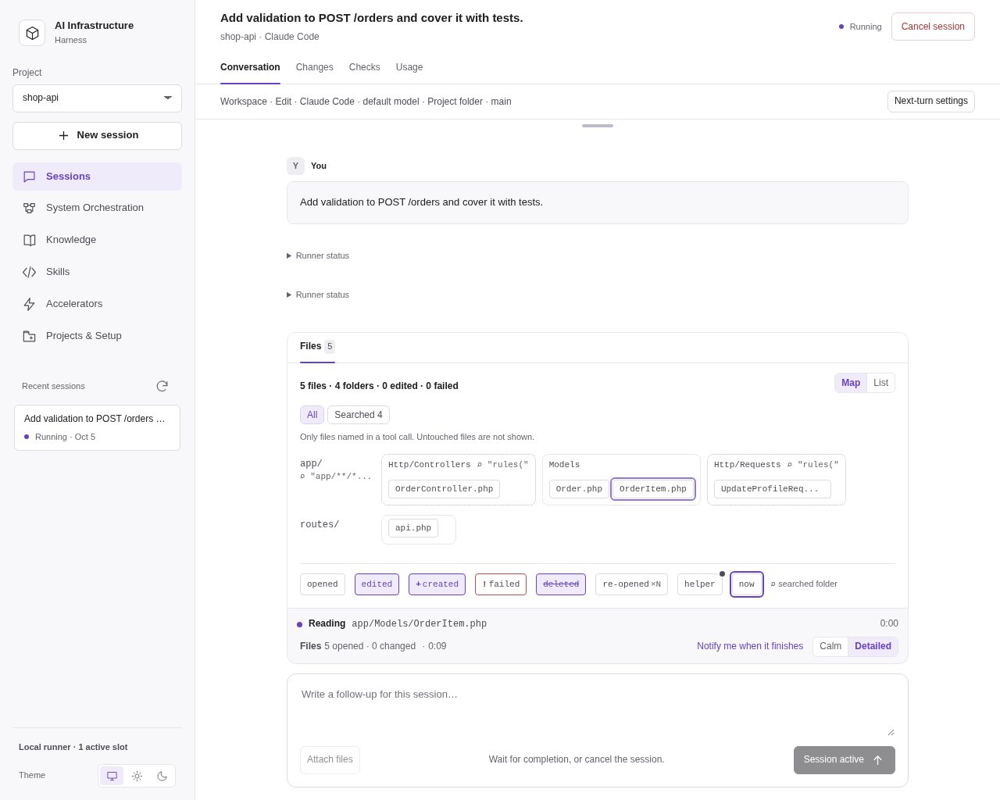
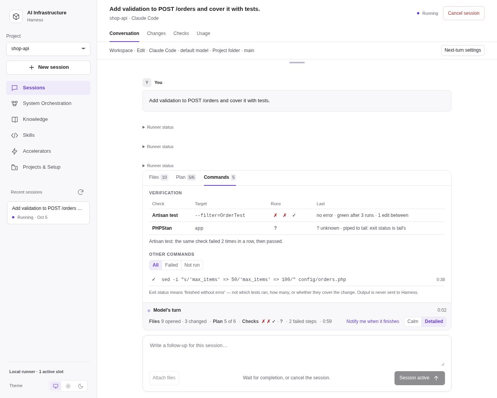
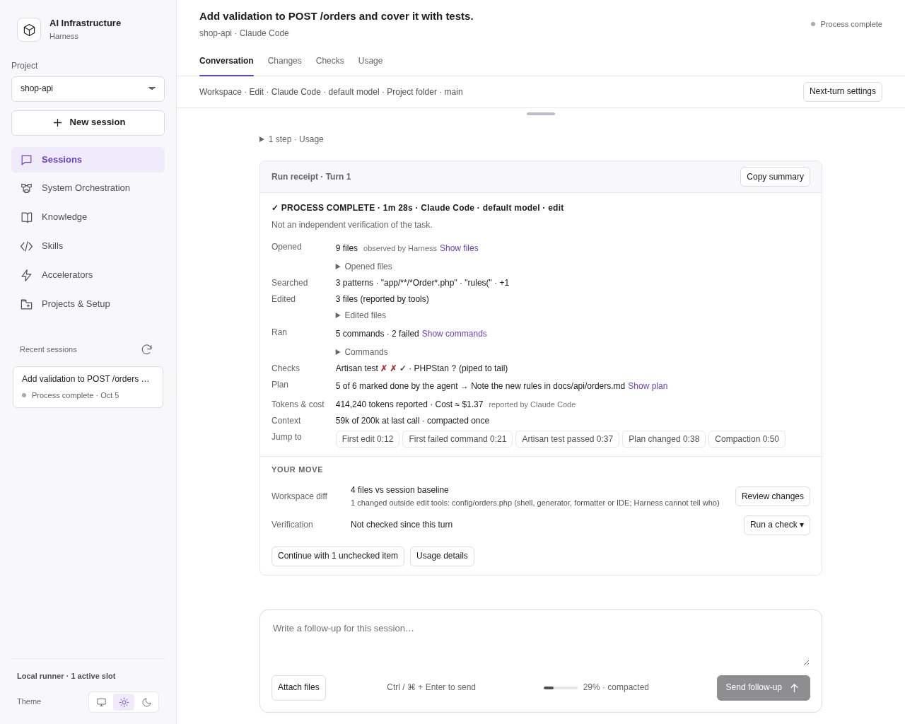

# AI-Infrastructure Harness

A local browser workspace over **Claude Code, Codex and Cursor Agent**.
Kit 1, Kit 2 and Kit 3 are sections within the workspace. The optional
LangGraph batch runner remains available separately below.

In **Sessions**, use **Attach files**, select files and write your message. You
can remove files before sending. Each message accepts up to five files, 4 MiB
per file and 8 MiB total. Sent files appear as downloads in message history and
survive server restarts. Unsent selections remain in the current page only.
Uploads are stored under the Harness state directory, outside the selected
project/worktree. Native agents receive local paths and read them using their
available tools; document/image format support depends on the provider and tools.
Filenames and sizes are validated, and stored bytes are checked before use.
Attachments are reference data and are not automatically executed or promoted
into Memory Bank. A failed send retains the selected files for correction.

## System orchestration in the browser

**System Orchestration** coordinates development changes across registered
service repositories. It has two tabs and works on the project chosen in the
sidebar: **Services** holds the system file, its contract map and the editor;
**Changes** holds plans, launches, agents and receipts. On **Services**, choose
**Choose system folder…** to open another folder as the system project (it is
added to your projects and becomes the working project in every view), then
**Create or edit system**.
Use **Add service folder** to browse existing folders; selected folders are
registered automatically. Select **Codex, Claude Code or Cursor Agent**, then
**Fill with AI** to discover the system name, service IDs, owners, responsibilities,
capabilities, contracts, dependencies and context sources from a bounded evidence
snapshot. The ordinary forms are populated automatically, with cited files and
uncertainties available for review. Unknown owners stay `unknown`; complete
dependency coverage stays unconfirmed. Review or adjust the result, then
**Save system**. The application writes `system.json` and service passports,
no JSON editing is required, and the editor gives way to the updated map.
Existing systems open in the same form.
AI scanning uses the single Harness queue, supports cancellation and restores
its original draft after interruption/reload. It requires bubblewrap on Linux or
`sandbox-exec` on macOS, plus an installed/authenticated native CLI. The agent
reads copied evidence; original service folders and unrelated projects are absent
from its filesystem. OS/CLI runtime and that provider's native account state remain
available for login and normal CLI operation. This is not isolation from the
provider's own account/history data. Secret patterns, links, binaries, dependency
trees and ineligible memory chunks are excluded. Limits are 50 services, 120 files
and 1 MiB per root, 64 KiB per file, 8 MiB total; omissions are reported. Sources
are checked again before accepting results and at both save stages. Manual
editing remains available when a CLI or isolation backend is unavailable.
A failed scan names its cause (for example an expired CLI login with the command
to sign in again, or a host that blocks bubblewrap's user namespaces), and the
editor warns before scanning when the sandbox cannot start on this host. See
[Troubleshooting AI discovery](../docs/AI-SYSTEM-ORCHESTRATION.md#troubleshooting-ai-discovery).
Alternatively, **Load system** reads an existing relative system file
(`system.json` by default). Inspect the declared graph, capabilities and memory
ownership, then **Plan a change** (or **New change** on the **Changes** tab):
describe the task, choose starting services or changed contracts, and prepare a
bounded context/impact plan. Review its sources before execution. The backend
checks freshness again when queued work actually starts.

A change moves through **Plan**, **Review**, **Run** and **Receipts**. In the
**Launch** card of the reviewed plan, choose **Codex, Claude Code or Cursor
Agent**. Each uses
its configured CLI and default model. The provider is fixed after launch,
including recovery. Browser requests cannot supply executables. Workers run
sequentially through the same single Harness queue;
read-only is the default. Native system/service Brain task records are written
even in read-only mode. Edit mode uses each service's current checkout.
**Service folder access** decides which selected service folders agents may use:
**All selected services** (the browser default) lets every agent read all of
them and, in edit mode, lets each service agent change files in any of them;
**Own service only** keeps each service agent in its own folder. The system
folder stays read-only. Claude receives the folders through `--add-dir`, Codex
through writable roots; Cursor Agent supports only own-service access.

The **Agents** panel follows a launched run live: one card per agent (contract,
each service, verification) with state, time, granted folders, tool calls,
tokens and changed files, and a timeline of what the selected agent says, plans,
reads, runs and edits. Paths appear as `service · path`. It stores no file
contents, diffs, command output or prompts, redacts detected secrets and is
bounded per agent and launch; receipts stay authoritative. During **Fill with
AI** the same panel follows the discovery agent and maps copied evidence back to
original service paths.

Saved changes show dispatch state, worker-reported checks, scoped changed files,
the knowledge handoff and, behind a toggle, native task references and the
runner log. Cancel stops provider trees;
recovery requires an explicit resume and an explicit dispatch retry after an
ambiguous interruption. Inspect partial edits before accepting changed sources.
Completed dispatches are skipped, and server restart never automatically resumes
work. The folder picker registers external service roots; existing manifests
can also use project folders chosen in **Sessions**. The manifest
cannot grant host filesystem access. See the [system orchestration guide](../docs/AI-SYSTEM-ORCHESTRATION.md#harness-ui).

## Infrastructure Creator in the browser

Choose **Infrastructure Creator** (also available through Kit 1), a registered
PHP project, Claude/Codex/Cursor, model, thinking effort and additional-agent
limit. Choose the current project or a new Git worktree, select the integrations
to generate, and start a scan. A worktree starts from committed HEAD; uncommitted
files are not copied. Targets must be outside the Harness source/state trees.

The server copies the existing generator into a private task workspace and runs
its native workflow in the shared session queue. Filesystem isolation is
required: **bubblewrap** (`bwrap`) on Linux, or the built-in **sandbox-exec**
(Seatbelt) on macOS, or native **Codex elevated sandbox** with permission-profile support on Windows. Agent writes are confined to the workspace, a private
temporary directory and native provider account-state directories; the project
and Creator control files stay read-only (bind mounts on Linux, write denial on
macOS, elevated capability/ACL policy on Windows). Native authentication remains with each provider. Network
access and native integrations remain available; this is filesystem isolation,
not a general-purpose sandbox for hostile plugins. Apple marks `sandbox-exec`
as deprecated but still ships it; a provider CLI that must write outside its
account directory fails inside the profile and reports it. Creator model-phase budgets can
be changed in the browser; empty time means no time limit. Apply and rollback
do not inherit model budgets.

Read the scan profile, generation plan and quality report, answer any questions,
and choose **Approve profile & generate**. Canonical generator validators run
independently after the provider exits. Generation ends at staging. Inspect the
file diffs and approve each replacement of existing team edits before choosing
**Apply reviewed files**. A changed project, staging payload or reviewed report
invalidates the approval. To preserve or merge a file differently, request a
revision; the generator prepares a new candidate and ownership manifest.

**Update existing accelerator** requires `.infra-manifest.json`. Runtime memory
and Project Brain records cannot be overwritten by the publication plan. Apply
uses the existing manifest-last publisher, then validates the installed target
with a disposable SQLite cache. On Linux that cache is a temporary overlay and
verification does not change the project cache; on macOS the project's ignored
`memory-bank/local` cache is rebuilt in place, because Seatbelt cannot overlay
a directory.
A failed postcheck rolls back; an interrupted publication exposes **Recover
interrupted publication**. Recovery preserves external edits made since apply
and reports conflicts instead of silently replacing them. Runs, reports and
recovery journals survive restarts in the server's private `creator/` directory.
Apply/recovery cannot be cancelled from either the Creator UI or session API.

Automated coverage uses disposable native CLI fixtures, real bubblewrap mounts
on Linux, an offline check of the generated Seatbelt profile and the canonical
publication/rollback helpers; model-generated content still
requires the scan and diff reviews and independent verification gates.

## Browser server

### Spec-Driven Development

In **Sessions → Workflow → SDD**, enter a feature slug such as `user-login` and
choose **Initialize**, **Specify**, **Plan**, **Tasks**, **Implement / resume** or
**Review**. Describe the request and launch the selected phase with Claude,
Codex or Cursor. The feature stays fixed; the phase can change on follow-up turns
in the same native session and workspace, including a Git worktree.

New documents live in `specs/<feature>/sdd-{spec,plan,tasks,progress}.md`; shared principles
live in `specs/memory/sdd-constitution.md`. The `sdd-` prefix satisfies installed
accelerator naming hooks. Existing unprefixed documents remain readable in place.
**Read SDD documents** shows bounded,
read-only snapshots from the session's actual workspace. Refresh after edits.
Review documents before explicitly selecting and sending the next phase.
Initialize only requests missing guidance; existing project documents are preserved.

The server requires nonempty, readable prerequisite documents (maximum 256 KiB
each) and blocks later phases while the specification contains
`[NEEDS CLARIFICATION` markers. It checks again before a provider starts, including
inside a new worktree. File presence is not semantic approval: native-agent
instructions limit each turn to its selected phase, and humans review its output.
Writing phases use Edit permissions; Review uses Plan permissions. Implementation
instructions require test-first tasks and stopping at the next checkpoint.
Use Results for diffs and independent verification commands. Phase settings are
saved in launch history alongside model, effort and budgets. No separate plugin
installation or automatic phase chaining is required.

### Clash: Claude and Codex confront each other

In **Sessions**, tick **Clash with a challenger** on a Workspace or Review
session. The selected provider is the first participant and a *different*
provider is the **challenger**. The stage follows the session mode:

- **Edit mode (implementation clash):** the first participant implements the
  task with Edit permissions. The challenger then reads the workspace and the
  diff against the session baseline in Plan permissions and returns a verdict
  with numbered objections (severity, file, line, claim, evidence). The
  implementer must fix, rebut or defer every open objection; the challenger
  re-checks and either accepts or maintains its objections.
- **Plan mode (review clash):** the first participant reviews the scope and
  reports findings; the challenger reviews the same scope independently, agrees
  with, disputes or cannot verify each finding, and adds what was missed; the
  reviewer defends or withdraws disputed findings and assesses the challenger's
  additions. The Review workflow always runs this stage.

Each cycle runs the opening turn plus up to the selected number of **challenge
rounds** (1–3, default 2). The challenger's final verdict ends the cycle; the
first participant responds only between rounds. The outcome is **converged**
when the challenger accepts with no blocking items, **unresolved** when the
rounds run out, and **incomplete** when a turn fails or returns no structured
verdict. Structured verdicts are parsed from the fenced JSON block each
participant is asked to end with; the ledger records every objection or finding
with its status and the exchange behind it. The ledger, per-turn usage and a
Markdown report are saved with the session and shown under **Clash ledger**;
Results shows the resulting diff for independent checks and delivery.

Every turn is a separate native run of one participant in the session's
workspace, resuming that participant's own native session. A follow-up message
with the box still ticked starts the next cycle: both native sessions resume,
the session mode stays fixed, and the challenger, the rounds or the challenger's
model and thinking effort can change. Untick the box to send an ordinary
follow-up; tick it later to have the challenger inspect the accumulated work,
continuing the earlier ledger when the stage is the same. The option is not
available for Plan, SDD or Fleet sessions, requires additional agents to be
off, and cannot be combined with separate planning and editing models.
Budgets apply to the whole cycle: Claude turns receive the remaining
USD allowance as a native cap, the token threshold counts every turn's reported
usage, and the time limit terminates the cycle. Cancel stops the running
participant; the ledger recorded up to the previous turn stays visible. The
ledger reports what each participant claimed and which claims survived; it is
not an independent verification of the work.

### Optional models for planning and editing

In Sessions, expand **Separate models for planning and editing** and enable
**Use separate planning and editing models**. Choose a model and thinking effort
for each role from the selected provider, or enter a custom model ID. The common
model controls display the effective selection while this option is enabled.

In SDD, **Implement / resume** uses Editing; Initialize, Specify, Plan, Tasks
and Review use Planning. Writing specification documents does not select the
code-editing model. In Workspace, **Mode → Plan/Edit** selects the role and can
change between turns while the option is enabled. Plan and Review workflows
always use Planning. Fleet and Creator retain their existing model controls.

Both role configurations are validated before launch. Changes apply when sending
the next turn and persist with the session; each launch retains its effective
model, effort and routing settings. Disable the option to use the common model
controls again. The default remains one model, and new sessions start with the
option disabled. Switching stays within one native provider and preserves the
session/workspace; it does not transfer conversations between providers.

### Starting the server

Supports Linux, macOS and native Windows 10/11 through Git Bash, with Python 3.10+ and at least one authenticated native
agent CLI. The web server uses only Python's standard library; no venv,
Node frontend build or API-key form is required.
Fleet review additionally uses the optional LangGraph runtime described below.

On Windows, install Python, Git for Windows and the native agent CLI, then run
these commands in Git Bash. The launcher tries a working Python 3 interpreter
named `python3`, then `python`; a Microsoft Store alias is skipped. State defaults
to `%LOCALAPPDATA%/ai-infrastructure-harness` (Linux/macOS retain XDG state).
Projects and state must use local drive paths; junctions, symlinks and UNC/network
roots are refused at protected filesystem boundaries. npm-installed Codex and
Claude launch through Node.js directly; arbitrary `.cmd`/`.bat` check scripts
are refused. Use a native executable or Node/Python script for checks.
System Orchestration runs on Windows too. Its AI discovery (**Fill with AI**)
runs in Codex's elevated sandbox, like Creator phases, and needs Codex for that
even when Claude or Cursor scans. Before each scan a probe checks inside the same
sandbox that no original file is readable.

Infrastructure Creator on Windows also needs Codex CLI, even when the selected
provider is Claude or Cursor. Complete elevated sandbox setup in native Codex
(the setup may request UAC). Harness supplies a random per-launch permission
profile; target, Git common directory, source and control state remain read-only.
A native boundary probe runs before each phase; failure stops the phase without
falling back to unelevated execution. Provider state must not overlap protected
project or Harness directories. Installed runtime checks use a disposable copy
so the target SQLite cache is unchanged. Git Bash must provide `bash` for hook
syntax checks; NTFS does not provide Unix executable permission bits.
The probe scans protected trees with a 100,000-entry limit; large trees add
startup time and trees beyond that limit are refused. Validation copies are
limited to 50,000 files, 256 MiB total and 4 MiB per file.
Native providers run under the sandbox account. File-based credentials remain
in their existing account directory; Windows user-keyring credentials may need
provider-specific setup and are not copied or exported by Harness.
The `windows-harness` CI job covers portable/native runtime unit tests and a
System Orchestration run with an npm-installed Codex fixture. The
manual `Windows Creator sandbox` workflow requires a self-hosted Windows runner
with elevated Codex already configured; it runs actual write-denial and owner
death tests without model credentials. Native sandbox checks cannot run on a
Linux workstation.

From the repository root:

```bash
./harness-server start --project /absolute/path/to/project
# Started: http://127.0.0.1:8766
./harness-server status
./harness-server stop
```

`start` detaches the server from the terminal. `serve` keeps it in the
foreground. Repeat `--project` to register more directories; without it,
the current directory is registered - unless it is this clone, in which case the
browser starts by asking for a project folder, as DeepSeek Harness asks for a
workspace. **Sessions** registers additional folders while the server is running
(**Choose a project folder**). UI registrations persist across
restarts alongside the command-line projects. Stop and start again to change
server options such as its port or provider executable:

```bash
./harness-server start --port 8766 --timeout 900 \
  --project /path/to/project-a --project /path/to/project-b \
  --cursor-bin /absolute/path/to/cursor-agent
```

`--claude-bin` and `--codex-bin` also accept explicit executables. Discovery
checks the CLI's identity and required Cursor flags; an unrelated command
named `agent` is not accepted as Cursor. Cursor auto-update is disabled on
all harness invocations so it cannot replace another tool's launcher.
Authenticate using each native CLI in a terminal before running browser
tasks. Existing native credentials remain managed by that CLI. A detected
executable does **not** prove that its account is logged in.

**Sessions** therefore asks each found CLI whether it is signed in. These
commands make no model call and take well under a second:

| Provider | Asked with | Sign in with |
| --- | --- | --- |
| Claude Code | `claude auth status --json` (`loggedIn`) | `claude auth login`, or `/login` inside `claude` |
| Codex | `codex login status` (exit status) | `codex login` |
| Cursor Agent | `cursor-agent status --format json` (`isAuthenticated`) | `cursor-agent login` |

A provider whose CLI says it is not signed in is listed as
`Claude Code · not signed in`. A note names the sign-in command and, for a new
session, offers a provider that is signed in (**Use Codex**). The page asks
again when it regains focus, so signing in from a terminal clears the note.
The check is advisory and never refuses a run. A CLI set up for another backend
reports `unknown` and gets no note: Bedrock, Vertex, a key in the environment
(`ANTHROPIC_API_KEY`, `CODEX_API_KEY`, `CURSOR_API_KEY`, and so on) or a custom
Codex provider. When a run fails because the CLI refused its account, as with
an expired Claude OAuth sign-in, the session error names the provider and the
command that signs it in, instead of the general failure. The command shows the
executable's path when the Harness found the CLI outside `PATH`.

### Desktop application

To start the accelerator like any installed application, run once from the
clone (in Git Bash on Windows):

```bash
./accelerator-app install
```

**AI Accelerator**, with the hare icon, then appears among the installed
applications:

| Platform | Where it appears | What is written |
| --- | --- | --- |
| Linux (GNOME, KDE and other XDG desktops) | the application menu and search | `~/.local/share/applications/ai-accelerator.desktop`, `~/.local/share/icons/hicolor/*/apps/ai-accelerator.*` |
| macOS | Launchpad, Spotlight, `~/Applications` | `~/Applications/AI Accelerator.app` |
| Windows | the Start menu, and **Settings › Apps › Installed apps** with **Uninstall** | a Start menu shortcut, `%APPDATA%\ai-infrastructure-harness\ai-accelerator.ico`, an Uninstall entry under `HKEY_CURRENT_USER` |

A click runs `./accelerator-app open`. If the server is not running, it starts
it from the clone, as `./harness-server start` does, so the browser asks for a
project folder. Then it opens the server in the default browser. The entry runs
the clone itself, and nothing else is copied. On Linux, the icon's menu also has
**Stop the accelerator server**.

#### Updates

The application keeps itself current, as desktop applications do. The server
checks the branch the clone follows, `main` on origin for a clone made to use
the accelerator, when it starts and then hourly. It also checks when the page
comes back after ten minutes away. Each check is one `git fetch` of that
branch.

While the clone lacks commits, an **Update** button sits at the right of the
page header, on every page and at every width. Hovering over it shows the new
commits.

A click runs four steps:

1. It fast-forwards the clone.
2. It rewrites the installed application from it, because the icon or entry
   may have changed.
3. It restarts the server on the new code.
4. It reloads the page.

Projects attached to the clone take their edition from it, so they update with
it.

`./accelerator-app update` does the same from a terminal.

Only a fast-forward is ever applied, and some states hold the update back:

| State | What happens |
| --- | --- |
| The clone has commits of its own | The button gives way to a note: update it with Git. |
| A local change is in the way | The update is refused and the clone is left as it was. |
| Runs are in progress | The update waits until they finish or are stopped, because a restart would interrupt them. |
| The clone is not on a branch that follows a remote | Nothing is offered, and the status says why. |

To keep checks off, set `HARNESS_UPDATE_CHECK=0` in the server's environment.

#### The environment of a desktop launch

A desktop launch lacks the `PATH` additions of a shell profile, such as
`~/.local/bin`, nvm or Homebrew. That is where the Claude, Codex and Cursor
CLIs, and often Python itself, usually live. Three things make up for it:

- The application entry names the Python that ran `install`
  (`ACCELERATOR_APP_PYTHON`). The launcher falls back to `python3` and `python`.
- Before it starts the server, `open` reads the `PATH` the login shell sets up
  today, as VS Code does for a desktop launch. It runs `$SHELL -ilc` with a
  10-second limit and reads the value between marks, so a greeting or prompt
  around it does not matter. This works with bash, zsh and fish. A CLI
  installed since `install` is therefore found without reinstalling.
- The `PATH` read last is kept in `app.json`. It is the fallback when the shell
  does not answer, put in front of the desktop's own. The file is in
  `~/.config/ai-infrastructure-harness/` on Linux,
  `~/Library/Application Support/ai-infrastructure-harness/` on macOS and
  `%APPDATA%\ai-infrastructure-harness\` on Windows.

If you move the clone, start it once from its new folder
(`./accelerator-app open`), and the installed application follows it. A second
clone leaves the application with the first one while the first still exists.

When the server cannot start, the reason appears as a desktop notification (a
message box on Windows) and in `launcher.log` beside `app.json`.

```bash
./accelerator-app status     # is the application installed, is the server running
./accelerator-app update     # what the Update button does
./accelerator-app stop       # stop the server
./accelerator-app uninstall  # remove the application; projects, sessions and memory stay
```

`harness/web/icons/ai-accelerator.svg` is the icon's source. The PNG sizes next
to it are rendered from it with `rsvg-convert -w N -h N`, and the Windows ICO
and macOS ICNS are built from those PNGs at install time. The browser tab shows
the same hare, with a badge while a run is active, needs you or has ended.

### Workspace options

The sidebar has five sections: **Sessions**, **System Orchestration**, **Knowledge** (Memory use,
Project Brain, Memory bank and Context files tabs), **Skills** (Library and Create skill
tabs) and **Accelerators** (Overview, Infrastructure Creator, Open Source Kit and
Install into project tabs). Every view has its own address, such as
`#/brain` or `#/creator`, so a reload or the browser's Back button returns to it.
The **Project** selector at the top of the sidebar applies to every view; choosing
another project while a session is open starts a new session draft for it, and its
last entry, **＋ Choose a project folder…**, adds a folder the way the Sessions
**Project** chip does.

- **Sessions:** the project folder (**Project** chip: choose a folder, see and switch
  its attached accelerator edition, approve its Codex hooks), Claude/Codex/Cursor, model and thinking effort,
  Workspace/Plan/Review workflow, Plan/Edit mode, project memory (on by
  default), additional-agent switch and a concurrent helper limit (1–40, default 3).
  Shows the selected project's Git branch and changes, with a refresh control.
  Choose the project directory, a new Git worktree with an optional new branch name, or
  an existing Git worktree of the same repository (see [Existing worktrees](#existing-worktrees)).
  Type `/` at the start of a message for the CLI's own commands, and `$` in a Codex session for its
  skills (see [Slash commands](#slash-commands)).
  The launch fields sit in one row; optional settings are chips (Helpers, Clash,
  Run in, Memory, Budgets, Models) that show their current value and open one
  panel at a time. An open session collapses to one summary line; **Next-turn
  settings** expands what a follow-up can change. Native messages appear as they
  arrive, and consecutive tool steps fold into one row (see [Watching a run](#watching-a-run)). Cancel stops the
  process group; follow-ups resume the same native session and workspace directory.
- **Clash with a challenger:** a checkbox on Workspace and Review sessions that
  pits the selected provider against a different challenger provider on the
  implementation (Edit mode) or the review (Plan mode); inspect the
  objection/finding ledger and each turn's usage, then continue with a follow-up
  cycle. See [Clash](#clash-claude-and-codex-confront-each-other).
- **Fleet review workflow:** select code, security and/or performance reviewers,
  inspect their stages and findings, then approve or reject the report. Native
  reviewers run directly through the selected Claude/Codex/Cursor provider in
  plan mode, without nested helpers. The additional-agent limit bounds concurrent
  reviewers. Offline dry-run uses labelled synthetic findings and no model calls.
- **Changes, Checks and Usage:** tabs of the open session next to Conversation. Changes shows the files and Git diff
  (and Worktree delivery for worktree sessions), Checks runs an explicit
  test/lint command in its workspace, and inspect persisted output, exit code and
  check status separately from the agent outcome. Shows every recorded launch
  and total reported tokens, USD and run time; missing provider usage stays unknown.
  Usage opens with **Context**, how full each turn left the context window; see
  [Context window](#context-window).
- **Project context:** availability and size of a fixed set of project
  instructions and references: `AGENTS.md`, `CLAUDE.md`, `README.md`,
  `project-brain/README.md` and `specs/MANIFEST.md`. There is no switch for
  them: they are part of project memory (see [Project memory](#project-memory)). A turn whose prompt carries a memory capsule
  sends no excerpts. Without one, the first launch of a conversation sends up to
  3 KB of each file the provider does not load by itself (Claude loads
  `CLAUDE.md`, Codex `AGENTS.md`); a resumed conversation already holds them.
  Symlinks are skipped.
- **Memory use:** how a knowledge root's memory grows, moves, ages and gets
  selected: Project Brain records, promotions, Memory bank chunks and the last
  200 retrievals on this machine, with the chunks that need attention. See
  [Memory use](#memory-use).
- **Memory bank:** browse a project's `memory-bank`, select a document and
  read its Markdown source, including chunk metadata and status. The repository's
  Laravel, Symfony, PHP Core and WordPress banks appear separately. The viewer
  lists Markdown in the bank root, `chunks/` and `local/` notes; derived SQLite
  indexes, scripts, templates and Project Brain records are excluded. Browsing
  does not execute scripts or change files. Separate controls run context search,
  index maintenance, validation, source-freshness audit, re-attestation, retirement
  and privacy-filtered export through the selected project's installed CLI.
  Listings are bounded to 500 documents and document previews to 256 KiB,
  with visible truncation notices.
- **Project Brain:** browse tasks, findings, bugs, incidents, decisions, events,
  handoffs, promotion records and archives. Start tasks, create operational
  records, update progress and complete tasks through the existing governed
  runtime. Numeric revisions protect updates and completion against stale edits.
- **Accelerators:** the Overview tab presents the three kits. Kit 1 is the
  **Infrastructure Creator** tab for the full Scan → Review → Generate → Apply
  workflow and manifest-aware updates. A selected run shows its phase as five
  steps (Scan, Review profile, Generate, Review files, Apply); **New run** opens
  the form for another one. Kit 2 opens **Install into project**, the
  installer for Laravel, Symfony, PHP Core or WordPress, for a team that wants
  an edition's files in the project's Git (sessions already use it attached). Its **Startup context
  per edition** table lists the exact bytes each edition puts in front of the
  model before any work: AGENTS.md and the skill, command and agent listings.
  The table sets them against the ceilings `scripts/context_budget.py --check`
  holds them to, and measures them with the same script, so the page and the CI
  gate cannot disagree.
- **Open Source Kit:** the Kit 3 catalog, filters, dossiers and copyable
  installation commands as a tab of Accelerators; inside the Harness the catalog
  drops its own header, hero and footer. **Open in new tab** shows it standalone.
- **Skills:** choose a registered project and a catalog source, click **Load
  skills**, select individual skills and Claude/Codex/Cursor, then **Preview
  installation** and **Install selected skills**. The preview lists every
  destination and any conflicts. Installation adds missing files, keeps
  identical files and refuses differing files or unsafe paths. The installed
  list shows one row per skill with a chip for each tool that has a copy (path
  and source in the chip's tooltip); start a new agent session to load newly
  installed skills. While you browse the catalog, a bar at the bottom keeps the
  selection and **Preview installation** in view. Tracked skills show their source and commit (or
  a content hash for local skills). Use **Check update** or **Preview removal**,
  review the file diffs, then apply the single-use preview. Local edits and extra
  files block updates/removal. **Refresh source** reloads the catalog snapshot
  without restarting the runner.
- **Create skill:** write a name, a description of when the skill should be
  used, and Markdown instructions. Select a registered project and tools,
  then preview the generated `SKILL.md` and its destinations before saving.
  Creation works offline without Node.js or a model call. It shares the
  Skills installer's collision checks and never overwrites an existing file.
  The form draft survives section changes until the page is reloaded.
- **Theme:** the switch at the bottom of the sidebar chooses **System**,
  **Light** or **Dark**. The choice is stored in this browser and applied before
  the page paints; **System** follows the operating-system setting as it
  changes. The Kit 3 catalog follows the same choice, including when opened in a
  new tab from the Harness; served alone by `./kit3 serve`, it follows the system.

Worktrees start from the selected project's current committed `HEAD`; uncommitted
changes and untracked files stay in the original checkout. Git and at least one
commit are required. A blank branch name creates `codex/harness-<session-id>`;
an existing branch name is refused. For a project inside a repository, the same
subdirectory is used in the worktree and must exist in `HEAD`. The worktree and
branch remain after a session finishes or the server restarts, so results can be
inspected and committed. They live under the server state directory's `worktrees/`
folder; the session displays its exact directory and branch when created.
Follow-ups refuse a missing worktree or one belonging to a different repository.
Use **Results & usage → Worktree delivery** to commit selected files and transfer
a reviewed commit to a local project branch. Use normal Git worktree commands for
other worktree management. Project context in a run comes from its selected workspace; the separate
Memory bank and Skills sections continue to use the registered project directory.

#### Existing worktrees

**Existing Git worktree** runs a new session in a checkout you made yourself, for
example with a script that also prepares the task's environment (containers, `.env`,
`vendor/`). The list comes from `git worktree list` for the registered project's
repository. It shows every other checkout except the project's own folder and
the Harness's own worktrees. Each entry shows its folder and branch, or
*detached* and the commit; the full path appears under the picker. Nothing is
chosen for you. A checkout whose folder is missing, sits behind a symbolic
link or lacks the project's subfolder is counted under the picker, not listed.
Anything inside the runner's state directory, including Delivery's
disposable check worktrees, is left out entirely. An entry's ID covers its path
and its branch (or commit when detached). A folder your script reused for
another branch is a new entry, and a choice made from the old list is refused
until you refresh. **Refresh Git** lists the worktrees again; a draft remembers
the choice per project.

The session runs in that checkout as it is: its branch, uncommitted and ignored
files and prepared environment are used, and the Harness copies, resets or
removes nothing. For a project inside a repository, the same subfolder of the
worktree is used. Follow-ups accept a branch you switched there, and refuse a
checkout that Git no longer lists, that was replaced by a link, or that belongs
to another repository. Worktree delivery stays with the Harness's own worktrees:
commit and merge an existing worktree's work with your usual Git commands. The
picker sends a listing ID, never a path; the runner looks the ID up again in
Git's list before it creates the session.

**Results & Verification** compares the workspace with the commit recorded before
the first launch, including committed, staged, unstaged and nonignored untracked
changes. Pre-existing and external edits are included, so this is not an authorship
report. Older sessions without a recorded baseline use current HEAD explicitly.
Diffs are capped at 512 KiB / 500 files; large, binary or linked untracked contents
are omitted. Incomplete previews cannot establish verification freshness.

Checks run the exact command without a shell, in the same queue as agent runs.
They may modify the workspace; choose commands you trust. Output is bounded to
512 KiB, timeout is 1–3600 seconds, and **Cancel check** stops its process group.
A passing command proves only exit code 0. Checks keep the reviewed diff identity
and show when it has changed; ignored files and external services are outside that
comparison. Queued checks refuse a changed diff before executing. Check status
never replaces the agent's outcome. Creator retains its independent canonical
checks; its Results view aggregates launch usage across the run's phases.

Launch history and checks survive server restarts. History starts with this server
version; previous turns cannot be reconstructed. Totals include known usage plus
an explicit count of launches with unknown values, and remain after budget edits.
Check time is shown separately from model-launch time. Interrupted checks retain
their output and interrupted status after restart.

**Worktree delivery:** select pending files, enter a commit message and choose
**Preview selected files**, then **Commit reviewed files**. Pending files compare
with current worktree HEAD, separately from the full Results baseline. Selection
uses whole current files, including their staged and unstaged content. The preview
freezes the resulting Git tree; changed files, index or source HEAD invalidate it.
The commit preserves unselected edits and index entries. Git identity comes from
the repository/user configuration. Hooks and signing are disabled in this local
delivery path; use the Git CLI when those are required. Independent checks remain
explicit. An interrupted commit uses a journal to finish its index update on
restart when the recorded branch and index still match; unexpected external changes
block recovery for inspection instead of overwriting them.

Choose one source commit and an existing local target branch, then **Preview
transfer**. The runner rehearses a cherry-pick in a disposable detached worktree
and shows the resulting diff, recorded source checks and any conflicts. Only that
commit is transferred; preceding source commits stay separate. **Apply reviewed
commit** rechecks the source snapshot, target HEAD and checkout, then fast-forwards
the target to the prepared commit. The target worktree must be clean. Conflicts or
changed previews require a new review; ignored target files are not overwritten.
Unoccupied target branches use a temporary worktree without switching the primary
checkout. No push, remote fetch, branch deletion or source worktree removal occurs.
Source checks do not certify the resulting target tree. **Require a target check
before Apply** is selected by default: enter a trusted command and timeout before
previewing, then click **Run target checks**. The existing queue executes the command
without a model in a disposable detached worktree of the exact resulting commit,
from the selected project's relative directory. Dependencies and ignored files are
not copied; commands needing them must prepare their own environment. Output, exit
code, target branch/base and candidate SHA are saved in Results history. Cancel uses
the existing session cancellation; timeout, failure, cancellation, or changed tracked/
untracked files block Apply. Ignored build artifacts are allowed. A successful
check authorizes only its own preview; source/target changes still require a new
preview and check. Run only trusted commands: worktrees are not process sandboxes.

You may deselect the requirement before preparing a preview to deliver without a
target check; that choice is shown explicitly. The API accepts an optional `check`
object (`command`, `timeout`) in `preview_transfer`, followed by action `check` with
its `preview_id`. Apply enforces any selected check on the server. Preview state
survives page refreshes, but expires after 15 minutes (including checking time) or a
server restart; saved check logs remain. Results retain delivery commit IDs in
session events.

Delivery is available for ordinary session worktrees with their original branch;
Creator and current-project sessions retain their existing workflows.
Legacy sessions without a recorded baseline require another agent turn first.
Sparse worktrees and pending linked/special files are unsupported. Previews last 15
minutes, are single-use, and expire on restart. Lists show up to 100 non-merge
commits after the recorded session baseline. Pending changes are bounded to 500
files, 4 MiB per file and 64 MiB total; diff output is bounded to 512 KiB. Active
or queued sessions and checks block Git delivery through the existing global lock.

Custom skill names use up to 64 lowercase letters, digits and single hyphens.
Descriptions have up to 1,024 characters without angle brackets; instructions
have up to 32,000 UTF-8 bytes. The creator writes quoted YAML `name` and
`description` fields plus the Markdown body. The preview is invalidated when
the form changes. Supporting scripts and resources can be added separately
to the resulting skill folder when needed.

Skills discovery requires Node.js with `npx` and network access. It reuses
the Kit 3 pinned Vercel Skills manager in private temporary storage after
checking a bounded GitHub archive. Repository policy symlinks outside skill
folders are omitted; links inside skills are rejected. The cached source
snapshot stays fixed until **Refresh source**, a skill update check, or a server
restart. Public GitHub sources resolve HEAD through the [commit API](https://docs.github.com/en/rest/commits/commits#get-a-commit)
and download that exact commit; failed source checks do not report an update as
successful. Previewing does not change
the project; installation rechecks paths and conflicts and is available after
all agent sessions finish. Previews expire after 15 minutes and are single-use.

Selected files are copied to `.claude/skills`, `.agents/skills` (Codex), or
`.cursor/skills`. Other compatible tools may also discover `.agents/skills`.
Supporting files and executable permissions are preserved. This installs
standalone skills, not each upstream repository's plugins, hooks, or MCP
servers. Harness records source, revision and per-file hashes/permissions in its
private runner state. These receipts survive restart and manage updates/removal
through the UI; they are separate from Vercel's lock files and `kit3 update`.
Updates show additions, replacements, permission changes and removed upstream
files. Removal deletes only tracked files, keeping directories and other skills.
Before applying, the runner rechecks the receipt, project/directory identities and
all skill files, with the same active-session gate as installation. A local edit,
missing/extra file, symlink or hard link blocks the change. Diffs are bounded and
truncation is labelled. An interrupted update/removal reports completed writes and
does not advance tracking; inspect/restore the skill locally before retrying.

Older installations remain **Untracked**. Load the matching source and preview
installation to adopt an exact file-and-permission match; extra files prevent
adoption. Locally created skills are tracked by content hash and can be removed
without network access; they have no upstream update. Losing runner state loses
tracking, not installed skill files.
An interrupted installation may leave newly added files; refresh and preview
again to complete it. Existing files are never overwritten.

Source archives are limited to 16 MiB compressed and 64 MiB of files; one
installation is limited to 5,000 files and 64 MiB across selected tools.
Listings show up to 500 installed folders per tool. These bounds keep this
personal local server responsive.

**Model and thinking effort** can be selected when creating a session and
changed before the next message in an existing conversation. Active runs
keep their original settings. The model picker offers the provider's known
models and a **Custom model** entry for other IDs. **Provider default** adds
no model or ordinary effort override. Unsupported known
model/effort combinations are rejected before a run is queued.

Codex model choices and supported effort levels come from its local cached
catalog when available; the catalog is not a guarantee of account access.
Claude offers explicit versions, including Fable 5.1 and Opus 5, alongside
aliases labelled **auto**. Versioned entries send the full model ID;
auto entries let Claude choose the version according to its provider and
configuration. See [Claude model configuration](https://code.claude.com/docs/en/model-config)
for alias resolution and supported effort levels. Cursor has no
separate effort flag: select or enter its model variant, including an
`[effort=...]` suffix when that variant is supported by your account.
Model availability and custom model compatibility are ultimately checked
by the native provider. The picker does not fetch credentials or start a
model request to discover choices.

**Ultracode (workflows)** is available in Claude's thinking effort picker
for models supporting `xhigh` (Claude Code 2.1.203+). It combines `xhigh`
with native dynamic workflows, and requires **Use additional agents**.
The helper count is a required total in the prompt. It is not a native concurrency cap:
Claude bypasses its ordinary helper cap in Ultracode, and its workflow
runtime applies separate limits. Native permissions and workflow restrictions
still apply; disabled native workflows can leave only `xhigh` active.
Selecting another effort, including Provider default, explicitly disables
Ultracode and workflows for that turn, including on resume. This keeps
ordinary runs subject to their selected agent controls.

**Additional agents** are disabled by default; the main agent always runs.
Enable the switch and set **Required helpers** to require exactly that many
distinct helper launches on every turn, excluding the main agent. Each helper
must do a useful bounded subtask or independent check, and the model must wait
for and assess every result. Smaller tasks do not reduce the required count.
If native concurrency is lower, helpers must run in successive batches. Previous
turns, resumed helpers and repeated messages do not count as new launches.
If tools, permissions, task restrictions or remaining budgets prevent the full
count, the model must report the actual/required counts and explain the blocker.
The additional-agent choice is saved per session and reused on follow-up turns.
Between ordinary session turns, change **Use additional agents** or **Required
helpers** and send the next message to apply and save them. Active launches and
prepared context keep their settings locked; Fleet and Creator use their own
controls. Each launch retains its original helper settings in history.
Existing history migrates with helpers disabled.

Codex receives explicit native agent enable/disable and concurrency
settings, including its V2 main-thread offset. Claude disables its native
Agent/Task/Workflow tools when off; when on, it uses the native concurrent
subagent cap and limits spawn depth to one, and explicitly allows Agent/Task
tools for non-interactive requests. Explicit provider deny rules still apply.
Ultracode explicitly enables
the native Workflow tool; the same required total applies within native limits.
The values are passed per invocation,
without editing user or project configuration. These switches govern
native delegation tools, not every possible process an agent could run.
Cursor has no verified native CLI switch or numeric cap: both preferences
are passed in the prompt, and the UI explicitly labels them as instructions
rather than enforced limits. Enabling helpers can increase token usage.

The same requirement applies to Infrastructure Creator model phases. Fleet
continues to dispatch its selected reviewers directly, with nested delegation
disabled; its count still caps concurrent reviewers. A per-turn **Required helper
count confirmed / not confirmed** notice shows confirmed/required launches based
on native receipts, not the model's prose: Codex spawn completion with child IDs
or V2 `sub_agent_activity` start/completion receipts,
or Claude Agent/Task start/completion. Repeated receipts for one helper are
counted once. Only an exact match confirms the count; shortfalls and excess
launches are reported separately. A Workflow invocation alone does not prove
individual helpers ran; Cursor helper telemetry is not verified by the adapter.
Missing evidence is displayed without inventing success or automatically launching
paid retries. Native process completion remains separate from delegation evidence
and independent task verification.

Some Codex versions omit V2 helper activity from `exec --json`. Harness also
reads the matching thread's local journal to supplement partial stream receipts
through the read-only Codex state index. Only lifecycle metadata for the same
session, workspace and current launch/turn is accepted; earlier turns cannot
confirm a later one. Reads are bounded to the journal's last 4 MiB, and missing,
malformed or mismatched records remain unconfirmed. Model messages, prompts and
reasoning from the journal are never forwarded to the UI.

Plan/Review always use plan permissions. Codex uses its read-only sandbox
for Plan and workspace-write for Edit; Claude uses plan/acceptEdits;
Cursor uses plan/default agent mode with its sandbox enabled. These native
permission systems are not identical. The web UI does not implement an
interactive permission-approval relay or bypass native checks: a command
requiring unavailable approval can fail and must be handled in the CLI.

One run is active at a time, with a bounded queue of 16. This serializes
writes across registered projects. A configured time budget stops a run at its
deadline; a blank time field leaves it uncapped. **Cancel** still stops the run,
and a watchdog stops the process group if the server dies. After a restart,
unfinished sessions are marked interrupted and can be resumed if the
provider already returned a native session ID. Process completion means
the provider returned success, not that its code was independently tested.

**Budgets — money, tokens and time:** expand the section in Sessions or Creator.
Enter a USD cap ($0.01–$1,000), total-token threshold (1–1,000,000,000), and/or
elapsed time in whole seconds (1–86,400). Each empty field omits that limit,
including time. Settings persist with the session or Creator run.
Use **Save budgets** between launches or at a Creator checkpoint, then continue.
Active/queued runs keep their launch settings; stale edits are rejected.
For API clients that omit the entire `budgets` object, `--timeout` supplies an
initial time budget (900 seconds by default), returned in session settings.
Explicit `budgets.seconds: null` removes it. Browser forms always send their
budget fields explicitly, so a blank field never inherits a hidden deadline.

**Budget per agent** in session and Creator budget forms converts a per-agent
amount into the existing shared limits. Enter USD/tokens/time and click **Use
per-agent budgets**, then **Save budgets** for an existing session or Creator run.
For a new session, submit the resulting totals with the normal launch form. The
calculator never starts agents or saves on its own. It includes the main agent
plus allowed helper slots; disabling helpers counts only the main agent. Fleet
counts all selected reviewers, not just concurrent reviewers. USD and tokens are
multiplied by that count. Native time remains a shared deadline; Fleet sets the
reviewer timeout and multiplies it by `ceil(reviewers / concurrency)` for the
shared deadline. Setup also consumes this deadline, so allow extra total time
when needed. Blank fields clear shared caps; Fleet retains its separately
configured per-reviewer timeout.

The current totals also show equal shares (USD rounded down to six decimals,
whole tokens with an unallocated remainder). Native shares are planning guidance,
not independently enforced per-helper limits; actual helper counts may differ.
Fleet USD reservations can be smaller after spending/retries. Existing provider
support and aggregate limits still apply. Changing the calculator or agent count
does not overwrite totals until **Use per-agent budgets** is clicked again.
Calculated totals persist normally; the calculator inputs are a temporary draft.
Launch history retains the allocation used at launch, even after budgets change.


USD is supported by Claude's native `--max-budget-usd` flag. This is a stop
threshold, not a guaranteed billing ceiling: the final provider request may
overshoot it before cost is reported. Leave headroom when setting an allowance.
Overspending remains recorded, blocks successful review completion, and counts
against later Fleet allocations; it is never rounded down or retried automatically.
Codex and Cursor
have no verified monetary cap here. Native-session caps apply per turn; Creator
caps apply per scan/generate phase. From Claude Code 2.1.277 a resumed session
reports its whole spend, so each turn (and each Clash turn) counts only its growth
over the session's previous report, read from the CLI version the turn announces;
totals and caps never count an earlier turn twice. When that share cannot be told,
the turn's cost stays unknown. Fleet's USD cap remains shared across
reviewers and retries, with prior costs/reservations retained when edited.
If an earlier uncapped call has unknown cost, a new capped Fleet is required.
Fleet token/time thresholds apply per graph invocation; reviewer timeouts remain
separate. Creator apply/rollback do not inherit model budgets.

Token accounting sums reported input and output, including cached input once
(Claude reports cache reads/writes separately; Codex cached input is a subset).
The runner stops when reported tokens reach the threshold, but CLI usage may
arrive only on completion: this is **not a hard pre-request token cap**, and an
invocation may exceed it. Unknown tokens/cost remain unknown, and costs are the
CLIs' own estimates, so they read as ≈. The panel shows
last-launch usage and any reached limit, retained when settings change and reset
only when the next process starts. Time limits terminate the owned process group.

History is stored in a private SQLite database under
`$XDG_STATE_HOME/ai-infrastructure-harness` (default
`~/.local/state/ai-infrastructure-harness`) on Linux/macOS, or
`%LOCALAPPDATA%/ai-infrastructure-harness` on Windows; `--state-dir` selects a separate
instance. State and logs are local and are not installed into projects.
Keep that directory private: prompts and agent answers are retained there.

The server binds only to `127.0.0.1`. Browser mutations require a
per-process token and matching Origin/Host; static routes do not expose
repository files. This is a personal local tool, not a remotely hosted or
multi-user service. Fleet review runs the existing LangGraph graph in a separate
local Python process, with the same queue and workspace checks as native sessions.

The browser keeps the page's styles and scripts between visits:

- **Styles and scripts.** The server reads them once at start, and the page names
  each by its content hash (`app-core.js?v=…`). That address is cached as
  immutable, so an updated Harness changes the address and an old page never meets
  a new script.
- **The page itself.** It is revalidated by its hash on every load.
- **API answers and downloads.** They stay `no-store`.

The session list in `/api/bootstrap` and `/api/sessions` carries summaries: id,
title, project, status, times, provider, model, mode, workflow, Clash and Creator.
Opening a session fetches its full record, capsule included.

#### Interface copy

Keep the browser workspace quiet as it grows:

- A hint is one short sentence (about 12 words) and appears where a decision is made.
- No text for a disabled or unchecked control, except a provider limit that applies in that state.
- Show status only on change or trouble; a working state needs no "available" or "complete" line.
- Say each fact once, next to the control it concerns. Reference text goes behind a **?** toggle.
- Errors appear after the user acts, not on arrival.
- Never shorten away what will run, write or spend at the moment of decision.

#### Page files

The page has no build step. `harness/web/index.html` holds the markup and the
theme script that runs before the first paint, `app.css` holds the styles, and
classic scripts share their top-level names in load order: `app-core.js`
(shell, theme, routing, sessions), `run-model.js` and `run-view.js` (the run view's
event model and its strip, tabs and receipt), `composer-commands.js` (the composer's slash
commands), `app-knowledge.js`, `app-setup.js`,
`app-skills.js`, `app-creator.js`, then System Orchestration's
`agent-activity.js` (the agents panel), `system.js`, `system-editor.js` and
`system-discovery.js`. The server reads the page and the files
named in `ASSETS` (`harness/src/harness/web.py`) at start and serves nothing
else from the folder: add a new file to that list, and restart the server to
see an edit. `tests/test_harness_web.py` checks that the page and the list
name the same files and keeps the stylesheet on its color, type and spacing
tokens.

**Motion and numbers.** Durations and easings come from the motion tokens in
`app.css` (`--motion-*`, `--ease-*`); the same test rejects a literal duration or
`cubic-bezier()` in a rule, and reduced motion stops every animation, pseudo-elements
included. Scripted scrolls ask for `scrollMotion()`. Numbers use `fmt` in
`app-core.js`: exact values as grouped digits, estimates with ≈ and two significant
digits, bounds with ≤, ≥ or +, and — for unknown, which is never 0. A list that
refreshes on a poll renders through `keyedRender`, so open details keep their
state.

### Slash commands

In a Workspace session, `/` works as it does in the CLI behind the session. It opens a list only at the
start of the message, as in Claude Code and Codex, and the list follows what you type. Matches come in
this order:

1. a name or alias that starts with the letters;
2. a name with a word that does (`:`, `_` and `-` separate words);
3. a name that contains the letters;
4. a description that does.

Up and Down move through the list. Tab inserts the name. Enter inserts it too, and runs a command that
takes no argument, or only an optional one, as the CLIs do. Escape closes the list until you leave that
name.

- **Claude Code:** the list is the CLI's own. The Harness asks `claude -p` in the session's workspace
  with an `initialize` control request, using the session's launch settings with hooks off (a
  SessionStart hook would act on the checkout and on sessions running in it). This starts no turn and
  calls no model, and takes well under a second. The answer covers the built-in commands that work in
  print mode, project and personal commands and skills, plugin commands and MCP prompts, with each
  one's description, argument hint and aliases. The list is reused for a minute and forgotten when the
  Skills library installs or changes a skill. A name it lacks is checked against a fresh list once the
  cached one is a few seconds old.
  A message that starts with one of these commands goes to Claude Code exactly as you typed it, so the
  CLI runs it as in its own terminal. No memory capsule, project excerpts, Harness task or Harness
  instructions are added, and no memory draft is expected. Only the list of attached files is
  appended, and the project's own hooks deliver its memory. A session whose memory you review
  before each run refuses commands, since they would skip that review.
  A name the CLI does not list, or a slash later in the text, is ordinary text with the usual Harness
  context. When nothing would come before it, such a message is marked as the user's text, so the
  CLI does not read the slash as a command.
- **Commands the page carries out**, when typed alone or with one value:
  - `/clear` (also `/reset`, `/new`) starts a new session, since a resumed conversation cannot start
    over in place; in a draft, it only empties the field.
  - `/model [name]` and `/effort [level]` set the next turn's model and thinking effort, or open those
    fields.

  A sentence that merely starts with one of them is not run on the page. The API refuses all of them
  in a message, so neither the CLI nor the session settings change by accident.
- **Codex:** `codex exec` reads every message as plain text, so the Harness does what the Codex app
  would.
  - `$` where a word starts, anywhere in the message, lists Codex's own skills, from `codex app-server`
    `skills/list` (no model call): repository, user, plugin and system skills. Each `$name` in a
    message gets a *Harness skill request* line that names the skill's `SKILL.md`. Code is not a
    mention: in backticks, after `(` or a quote, or followed by `=`, `->`, `::`, `[` or `(`.
  - `/prompts:name` expands a custom prompt from `$CODEX_HOME/prompts` as the Codex app does. `$1`–`$9`
    are positional arguments, `$ARGUMENTS` is all of them, `$NAME` comes from `NAME=value`, and `$$`
    is a dollar sign. A missing named argument is refused before the run.
  - `/init` asks for an `AGENTS.md` contributor guide.
  - `/new`, `/model`, `/diff` and `/status` act on the page.
- **Cursor:** the list holds the project's Cursor skills. A message that starts with one gets a request line.
- **Commands only a CLI's terminal has.** Print mode accepts none of these, so in every CLI they open the
  Harness view that does the same. Each is marked *In the Harness* in the list:

  | Command | Opens |
  | --- | --- |
  | `/status`, `/cost` | **Usage** of the open session |
  | `/diff` | **Changes** of the open session |
  | `/resume` | the session list in the sidebar, focused on the newest |
  | `/memory` | **Knowledge**, on its last tab |
  | `/login` | a line saying whether the CLI is signed in, and the command that signs it in |
  | `/help` | this command list |

  A command of the same name from the CLI or the project wins, alias included. So Claude Code's `/cost`,
  an alias of its own `/usage`, goes to the CLI, and an accelerator's `/memory` still goes to Claude Code
  or Cursor. Codex already had its own `/diff` and `/status`.

Plan, Review, SDD, Fleet review and Clash write their own prompts. In those, `/` is plain text and no
list opens. Command lists start the native CLIs, so their routes need the page's token, like changes.

### File mentions with @

`@` where a word starts opens a search of the session's files and folders, as in the CLIs' terminals, in
every workflow and for every provider. An address such as `me@example.com` is not a mention. The search
covers the workspace the agent works in: the project folder, a chosen existing worktree, or the open
session's worktree. Inside Git it is the files Git lists, tracked and untracked but not ignored. Outside
Git it is a walk that skips `node_modules`, `vendor` and tool caches. The folders come from the files they
hold.

Only names are read, never file contents, and a listing is reused for 30 seconds. A workspace with
more than 50,000 files is searched in its first 50,000, and the list says so.

Matches come in this order:

1. a name that starts with the letters;
2. a path with a word that does;
3. a name, then a path, that contains them;
4. a path that holds the letters in order.

A query with a slash, such as `src/` or `src/bil`, first offers what is inside that folder, listed as a
directory is. Tab or Enter inserts `@path`. A file gets a space after it and sends nothing. A folder
stays open on what is inside it.

The path goes to the CLI as written:
- **Codex and Cursor:** the agent reads the file itself.
- **Claude Code:** the CLI has its own `@` attachments. Whether it applies them in print mode is not
  documented and was not checked here.

The search runs Git in the workspace, so its routes need the page's token.

### Connect and prepare a project

Choose the project in **Sessions**, as DeepSeek Harness chooses a workspace: the
**Project** chip (or **Choose a project folder** on the empty session, or the last
entry of the sidebar **Project** selector) opens a folder browser. The chosen
folder is registered and opened in a new session draft, and a PHP project gets its
accelerator edition **attached** from this clone; nothing is written into the
project. The edition comes from the project's own files (`laravel/framework` or
`artisan` → Laravel, `symfony/framework-bundle` or `bin/console` with
`config/bundles.php` → Symfony, WordPress packages, `wp-config.php` or a
theme/plugin header → WordPress, any other Composer or PHP project → PHP Core).
Sessions launch the native CLI with the edition from the clone - Claude Code
through `--add-dir`, `--append-system-prompt-file` and merged `--settings`, Codex
through `developer_instructions` and session hooks, Cursor Agent through
`--plugin-dir` - and Knowledge, Memory use and session memory work on the
accelerator's state for the project in this server's state directory
(`attached/<project id>`). The **Project** chip's panel shows the folder, the clone
and the state directory, switches or detaches the edition, and shows the Codex
hook approval (**Trust accelerator hooks in Codex** records it again). A project
with an installed accelerator keeps using its own files. See
[docs/ATTACHED-MODE.md](../docs/ATTACHED-MODE.md).

Either way the server keeps the project at this clone's version by itself: once
per version of the clone - at start, on registration and before a session's
memory - it brings an installed copy's untouched files and memory runtime up to
the clone (`scripts/install_accelerator.py --sync`), and, with Codex available,
approves the accelerator's own Codex hooks in your Codex config, the record
Codex's `/hooks` review writes; a team's own or edited hook is left for that
review. The conversation says what changed. The memory server's own entry in
`.mcp.json`, `.cursor/mcp.json` and the managed block of `.codex/config.toml`
follows the clone beside the project's own servers. Nothing is read or written
through a symbolic link inside the project, backups and the sync's record
included, even one another process swaps in while the sync runs: each folder
on a path is opened by descriptor without following links, and a folder
swapped during a write leaves the file alone. Such a path is reported instead.
Native Windows has no descriptor-relative file calls in Python, so there each
folder is checked just before it is used; a link that is there before the sync
starts is still refused, but the moment between check and write stays open to
a process that can write to the project. Set `HARNESS_CODEX_HOOK_TRUST=0` in
the server's environment to leave the approval to `/hooks`.

The folder browser navigates local folders, or takes an absolute path
directly. The folder picker provides Home, Parent folder,
hidden folders, and a case-insensitive name search through subfolders. Choose
**Use this folder**, then **Add project**. It browses the computer running the
server; no project files are uploaded or read. Recursive search skips dependency
directories (`node_modules`, `vendor`, virtual environments and Git metadata),
is limited to 8 nested levels, 20,000 entries, 200 results and 1.5 seconds,
and reports partial results so you can narrow the location. Symbolic links are
omitted; unreadable subfolders are skipped. Registration does not create or change project files. Paths containing
symbolic links are refused. An unavailable saved directory remains visible for
diagnosis after a restart. Readiness shows the Git branch and commit, the detected
provider CLIs and installed policy/context files; CLI presence does not establish
authentication. Setup does not inspect working-tree changes or run project Git
filters; the session workspace controls retain their full Git status check.

To put the accelerator's files into the project instead - for a team that
wants them in its own Git history - open **Accelerators › Install into project**,
choose an edition and one or more tools. Preview runs the existing accelerator
installer in private staging, using its versioned inventory and merge rules.
Review the file actions, diffs and any collisions before installing. Supported
root-file merges retain project policy and ignore entries; an existing project
README is kept and the accelerator README goes to `ACCELERATOR.md`. Other differing
files block installation. Truncated diffs are marked, and every selected file is
listed. The source checkout and server storage cannot be installation targets.

Installation consumes the reviewed preview and rechecks the source, target and
file contents. A changed file or expired preview requires a new preview. Active
agent sessions block installation. If filesystem failure interrupts publication,
the response reports completed writes; inspect the result and preview again before
retrying. The installer never reports that a partial operation succeeded. After
installation, inspect readiness and use the action to start a session in that
project. No model is called by registration, preview or installation.

### Project Brain and Memory Bank

Choose a registered project and its bank before using either view. Source editions
in this repository have separate banks; an installed accelerator uses the consuming
project's root. Browse operations only read bounded canonical files. The UI remains
a viewer when `memory-bank/scripts/context.py` is missing.

Explicit operation buttons invoke that selected runtime with fixed arguments:

- **Search** reads the existing local full-text index. Run **Index** after source
  changes or when no index has been built. Results can include other project
  context, not just durable memory chunks.
- **Status**, **Validate** and **Audit** report index counts, Brain validity and
  chunk source freshness. Even these CLI commands may create the local SQLite
  database; opening the viewer does not.
- **Reindex bank** regenerates `memory-bank/INDEX.md` from chunk metadata.
  **Reverify** records the operator's attestation that the chunk was checked
  against its sources. It does not independently verify the meaning of a claim.
  **Retire** archives a chunk or marks it superseded by its replacement.
- **Start task**, **Create record**, **Update record** and **Complete task** use
  the project's ownership, lifecycle, privacy and revision checks. Next-step
  entries are appended; progress is replaced. Completion requires a current
  numeric revision and an explicit outcome. Handoffs follow the runtime's task
  lifecycle rather than a separate editor.
- **Compact** moves terminal Brain records into its archive, preserving history.
  **Export** calls the CLI's privacy-filtered exporter and offers a ZIP download.
  It never accepts an arbitrary output path or overwrites a previous export.

The Harness adds no second knowledge database and does not directly edit records
to bypass runtime validation. Raw file editing and import are not exposed by these
controls. Export downloads are temporary server artifacts.

### Watching a run

While a Workspace, Plan, Review or SDD turn runs, a strip above the composer says
what the agent is doing now: the tool, its target and how long that call has been
open (`● Reading app/Models/Order.php · 0:03`), or *Model's turn* between calls.
Below it are the counts: files opened and changed, the agent's plan (*Plan 3 of 5*),
the last check runs (`Checks ✗ ✗ ✓`), failed steps and the time, with a warning from
80% of the time budget. After 30 seconds without events it says so instead of
guessing why. A Harness check reads *A Harness check is running*; Fleet, Clash,
Creator and System runs keep their own progress and show only their waiting line.

**Calm** is the default; **Detailed** (remembered in this browser) opens three tabs:

- **Files:** every file a tool named, as a chip with its name in folder blocks, in the
  order it was first touched. An outline is opened, a fill is an edit the tool
  reported as ok, `+` created, `!` a tool error, a struck name deleted, `×N` opened
  again, a dot a helper agent's file and a ring the call that is open now. Hover or
  focus a chip for its path and steps, **Show in conversation**, **Add path to
  message** or **Copy path**. **List** shows the same set as a tree. Untouched files
  are not shown, and Codex reads through shell commands, so its reads are not listed.
- **Plan:** the agent's own todo list with what was added or dropped. The agent
  ticks it; Harness does not verify it. After the run, **Continue with N unchecked
  items** fills the message box and sends nothing.
- **Commands:** PHP checks (PHPUnit, Pest, `artisan test`, PHPStan, Psalm, PHPCS, linters,
  Composer, Symfony and WordPress checks) as runs per target, other commands, and
  fixers such as Pint marked *changed files · not a check*. A pipe, `|| true`, a later
  `;` command or `&` makes the result *unknown*. After the run, **Run in Harness**
  fills the Checks form with the bare command and names what was removed; nothing
  runs until you press **Run check**.





Steps in the conversation name their target (`Bash · php artisan test --filter=OrderTest · failed`),
and each group sums them up (*Looked for "rules(" · opened 4 files · edited 1*). A
compaction leaves a divider. When the turn ends, a **run receipt** follows the
result: outcome and duration, files opened and edited by tools, searches, commands
and checks, the plan, tokens and cost as the provider reported them, moments to jump
to, the workspace diff (with files changed outside edit tools) and whether a Harness
check ran after the turn. *Process complete* is not a verification of the task.
Earlier turns fold into one line.



When the tab is in the background, its title and icon carry the state (`● Running`,
`✓ Finished`, `⚑ Needs approval`). **Notify me when it finishes** asks the browser for
permission on that click only; the notification says how long the run took and what
it cost, never the session title, a path or agent text, and makes no sound. Coming
back after two minutes or more shows *While you were away* with what changed and a
*New since* line in the conversation.

For native launches the runner stores each tool's target with its event in the local
`sessions.sqlite3`, beside the conversation it already keeps: the tool, a
project-relative path (only the name of a file outside the project), the command or
search pattern with secrets redacted, the outcome and Codex's exit code. A command keeps
its first line and stops at a heredoc, so a script or patch body is not stored; an MCP
tool shows only its name, never its arguments. File contents, diffs, tool results and
command output are never stored. Past about 4,000
targets in one launch the map stops (counts then read `≥`) and the receipt keeps the
full totals. Runs recorded before this show tool names only.

### Context window

**Sessions › Usage** opens with **Context**: how full the agent's context window
is, how much of it is memory the Harness sent, how the turn grew it and when
compaction cleared it. One bar per turn splits the window into memory parts
(Project Brain, Memory bank, Rules & docs), everything else at turn start, what
the turn added, and free space. A legend table carries the same numbers, and its
rows open into the capsule against its 8,000-character cap, each project excerpt
sent of its full size, and the rest: Harness instructions, a bound on earlier
turns' memory (reset by compaction), the rules the CLI loads itself and the memory
its hooks injected. A turns strip and a turn table compare turns.

Fill, window, growth and free space are the provider's own token counts:

- **Claude:** each main-thread model call is counted once by message ID, and
  subagent calls are left out. The window comes from the result, and compaction
  from `compact_boundary`. A turn on the same model knows its window from the
  earlier one, so a running turn fills in call by call.
- **Codex:** the counts come from the thread's rollout, read as it grows every
  two seconds while the turn runs and once more when it ends.
- **Cursor:** reports none; its turns show `—` and the characters the Harness
  added.

Memory parts are estimates: the capsule at 3.6 characters per token, prose at
4.7. The capsule is counted as the prompt carried it: the runtime's rendered text,
split by its item lines (a Memory bank chunk, a Project Brain record or episode,
any other path as rules and docs, each with the excerpt under it), or the JSON of a
runtime that renders none. Session launches of Claude add `--include-hook-events`
so hook output can be measured; it is split by the same item lines. Only its
character counts per memory kind are kept, and Codex hooks read as *not measured*.

Each launch stores these numbers in a `context` column, as integers plus the fixed
context-file names; no prompt, file or hook text. A Fleet or Clash launch row says
how much memory its prefix carried and to how many agents. Once the latest native
turn fills half its window, or compacts, a meter beside the composer shows the
percentage and opens this view.

### Memory use

**Knowledge › Memory use** is the first Knowledge tab. It follows one knowledge
root through four stages:

- **Project Brain:** records, open work and records resolved in the chosen window
  (7, 30 or 90 days, or all).
- **Promotion:** proposals applied after review or automatically, proposals waiting
  for review, and automatic ones that stalled.
- **Memory bank:** active chunks split by who vouched for them. A person wrote or
  reviewed **●**; **○** was auto-promoted and nobody re-attested it since.
- **Selected by retrieval:** how many of the last 200 retrievals put a chunk in a
  capsule, how many distinct chunks that was, and how many were cut. A selection
  shows that a chunk reached a capsule, not that the agent read it.

Below the stages, rows name trouble: chunks past their review date, chunks whose
cited files changed, and stalled promotions. A chunk past its review date also
fails bank validation, which stalls every later promotion until it is re-attested
or retired.

The **Last 200 retrievals** strip has one column per retrieval, and the **Review
horizon** places each active chunk by days until its review date. Both have a
detail card, keyboard navigation and a table with the same numbers. **Re-attest…**
and **Retire…** open Memory bank with the form filled in; the person still runs
the operation. The tab reads `Memory use · N` while N chunks or promotions need
attention.

Opening the view reads project files in the server process. It takes no knowledge
lock and runs no project code, so it cannot make a linked launch's freshness check
fail. Only counts, dates, chunk IDs and chunk titles reach the page. Project Brain
titles and bodies, retrieval queries and non-chunk paths stay on the server, and
private or restricted records count without their type or status. A Harness
launch re-checks its context before running, and that re-check counts with its
retrieval. **Check eligibility** is the one request that runs the installed
runtime's own rules. It names the rule that held back each resolved record and why
retrieval skips each chunk, writes nothing, and returns 409 while another
knowledge operation holds the lock.

Retrieval history outlives the 200 manifests a project keeps. This Harness folds
each manifest once into a daily rollup in its own database, either when Memory use
reads it or when a session launch in the project ends. The rollup holds counts per
day, routes and how often each chunk was selected; no queries or paths. Manifests
older than 120 days are not folded. **Selected by retrieval** shows the days as a
chart with a table, the stage card counts the flow window from them, and
**Never selected** looks at the whole history. Retrievals a project prunes before
either fold happens are not counted.

The view remembers your last visit in this browser. Coming back shows what changed
since then, such as new chunks, re-attestations, chunks that crossed their review
date and new retrievals, and replays only those changes. Reduced motion shows the
final state with a `+N` mark instead. To try it on a realistic project, build the
demo; its history goes through the copied runtime's own API:

```bash
python3 tests/harness_memory_demo.py /tmp/shop-api
```

### Project memory

Every new session uses project memory, and there is no switch to turn it off;
the **Memory** chip shows **Automatic**. Nothing waits for a person. The first message names a new Brain task
(`harness/<first words>-<6 hex>`, its goal the message's first line). Every message,
the first and each follow-up, is the retrieval query for its own turn: the server
runs the project's `context.py refresh` with the provider as host, so instruction
files the provider loads by itself (`CLAUDE.md`, `AGENTS.md`) stay out of the
capsule, and puts the capsule into the launch. The retrieval manifest stays in the
ignored `memory-bank/local/`, as the project's own hooks keep theirs. The launch
sets `CONTEXT_TASK_ID` to the task and `CONTEXT_CAPSULE_DELIVERED=1`, so the
project's read hook does not build a second capsule from the whole prompt; its
Stop hook still checkpoints the task. A line in the conversation says what each
turn carried: the task, the items by kind and the characters. If memory cannot be
retrieved, the line says why and the turn runs without it.

The prompt asks the agent to close its final reply with a `memory-draft` block
(825 characters of instruction per launch): where the task stands, up to three
next steps, and up to three learnings, each a finding or decision with the project
files that prove it. When a run completes, the server saves it: the task's
progress, its next steps (replacing the old ones), and each learning as a finding
(resolved) or decision (accepted). A learning is written as observed and raised to
verified with the reason "agent-attested, not reviewed by a person", so the
record's own ledger shows who attested it. Learnings citing no file in the
workspace, or already saved from this session, are left out. Then the project's
automatic promotion runs once (`context.py promote-auto`), under the runtime's own
rules and its `automatic_promotion` setting; promoted chunks are tagged
`auto-promoted`. A second line in the conversation says what was saved, promoted
or held back. A run that fails or is cancelled saves nothing. If a completed normal automatic run omits its draft or returns invalid JSON, one bounded read-only follow-up resumes the same native session to format it. The follow-up shares the launch budget, disables helpers/memory hooks, and never repeats the task; a failed attempt is reported without discarding completed work. The memory line names the delivered items, how many the run's own tools were seen to open (a lower bound when shell commands also ran, unknown when they were its only way to read) and, with the optional used_memory field, how many the agent reports using. See [shared memory integration](../docs/MEMORY-INTEGRATION.md) for direct-client MCP setup.

Choose an existing task, or a new task with your own ID and goal, under **Memory**;
memory still runs by itself for it. In a project without a governed context
runtime, sessions start with excerpts of the project's reference files instead of
retrieved memory, unless a task was chosen explicitly.

#### Review context by hand

Tick **Review context by hand** to review each turn's context before it runs. It
needs a context query. **Prepare session** creates the workspace first, binds the
task there and retrieves a bounded context capsule. Inspect the capsule before
choosing **Run with this context**. A bar above it shows how much of the
8,000-character cap the capsule uses, split into Project Brain, Memory bank and
Rules & docs, and names the items the runtime dropped to fit and the characters
repeated across the capsule's views. These counts are exact, measured on the
server the way the runtime measures the cap. The note beside the button estimates
what the capsule adds to the turn at 3.6 characters per token. The provider
receives that saved capsule; the server checks the task revision and source
contents again before launching it. Changed context requires a fresh preview. Each
chat follow-up also prepares a new capsule. These explicit retrievals disable the
runtime's repeat-query heuristic while retaining its privacy and source eligibility
rules. Sessions linked before memory ran by itself keep this flow.

A reviewed run's memory draft is saved when the run completes, as in any other
session, and the conversation says what was saved. Task actions stay in the
session's original workspace and bank, including when a worktree is used. The
reviewed capsule survives server restarts in session history; canonical task and
knowledge records remain owned by the project runtime. Offline Fleet demonstrations
cannot link a real task.

The conversation has no record or promotion tools. To complete a task with its
outcome and verification, or to create and verify a finding or decision by hand,
use **Knowledge › Project Brain**. Process success never completes a task
automatically. A Memory Bank proposal by hand goes through the project's runtime:
`context.py promote-propose`, `promote-review` and `promote-apply`. Manual proposals
require an independent reviewer and keep the runtime's source revision checks.
Prompts, transcripts and free assistant output never reach durable memory; only the
fields of a memory draft do.

### Fleet review setup and use

Install its declared dependencies once from the repository root (Python 3.10+):

```bash
python3 -m venv harness/.venv
harness/.venv/bin/python -m pip install -e harness
```

For native Windows/Git Bash:

```bash
python -m venv harness/.venv
harness/.venv/Scripts/python.exe -m pip install -e harness
```

Restart the browser server after installation. A different prepared Python can
be selected with `HARNESS_FLEET_PYTHON=/absolute/path/to/python`. Ordinary sessions
remain available when this optional runtime is missing.

1. Choose **Workflow → Fleet review**, a project/worktree and a provider.
2. Select reviewers and enter the review scope in the task field. For real
   reviews enable **Use additional agents**; its count caps concurrent reviewers.
   Each reviewer gets the selected model/effort. Ultracode is unavailable because
   this graph manages its own reviewers. **Offline dry-run** needs no authenticated
   CLI and does not execute the project's memory runtime.
3. Set a per-reviewer timeout if needed. **Budgets → Time** overrides the server
   timeout for that graph invocation. An optional USD budget is available
   for Claude; Codex/Cursor monetary cost is shown as unknown when unavailable.
4. Review the findings at **Awaiting approval**, then **Approve report** to save
   and download Markdown, or **Reject report** to finish without publishing it.
   The preview is visible before approval. Reports stay in local server storage.

Checkpoints live under `<state-dir>/fleet/<session-id>/`. A waiting review survives
server restarts. **Resume** on an interrupted/failed/cancelled run continues from
its checkpoint; successful reviewer nodes are retained. Provider failures stop
the graph and are not reported as code findings. Session settings stay fixed;
start another review to change its scope, reviewers, provider, or workspace.

Real runs use the selected workspace's `memory-bank/scripts/context.py`, when
installed, for task creation, capsule validation, dispatch events and progress.
This writes Project Brain audit records; it does not create a second project
knowledge store. Without that runtime the review runs without the project audit
trail. Graph status, findings and approved reports remain in private server state.

A finite budget is divided among reviewers and passed to Claude's native budget
flag. The browser reserves allocations before launching a reviewer and stores
them across retries. Known costs release unused allocation; interrupted calls
with unknown cost retain their allocation. A retry can therefore be refused
when no budget remains. Reported costs include metered failed attempts when a
reviewer later succeeds. Native provider accounting determines actual charges;
an over-allocation result fails the reviewer instead of claiming the limit held.

Verification from the repository root:

```bash
python3 -m unittest tests.test_harness_providers tests.test_harness_commands tests.test_harness_sessions tests.test_harness_web tests.test_harness_process_guard tests.test_harness_skills tests.test_harness_fleet tests.test_harness_knowledge tests.test_harness_memory_use tests.test_harness_memory_draft tests.test_memory_mcp tests.test_mcp_registration tests.test_harness_context_usage tests.test_harness_task_context tests.test_harness_setup tests.test_harness_creator tests.test_harness_results tests.test_harness_delivery tests.test_harness_clash
harness/.venv/bin/python -m unittest discover -s harness/tests -p 'test_*.py'
```

The Fleet integration tests use the optional runtime and synthetic/fake providers;
they skip when that runtime is absent. CI has a separate job that installs it.

The browser workflow was informed by the official
[DeepSeek Harness web mode](https://www.deepseek.com/harness/en/).
This implementation uses locally installed native CLIs rather than
vendoring DeepSeek's runtime or plugins.

## Optional LangGraph batch runner

External LangGraph batch harness for the AI-Infrastructure accelerators:
unattended multi-stage pipelines (nightly fleet review, mass migrations,
scheduled research) over headless coding-agent hosts.

The batch runner is **Stage D** of the agent-orchestration design
([`../docs/AGENT-ORCHESTRATION-DESIGN.md`](../docs/AGENT-ORCHESTRATION-DESIGN.md))
and a deliberate **companion, not a component**: it lives at the monorepo
root, OUTSIDE the editions — the installer never ships it, the inventories
never list it, no edition requires or depends on it, and the accelerator's
own runtime stays stdlib-only. This directory (with its own venv) is where
the LangGraph dependency is allowed to live.

## What it does

```
harness run --project /path/to/project --scope "HEAD~5..HEAD"
# ... runs lenses in parallel, then:
# PAUSED at the approval gate: {"findings": 7, "high": 2, "cost_usd": 1.84}
harness resume --project /path/to/project --thread fleet-review-... --approve
```

The `fleet-review` graph: scope → parallel review lenses (`Send` fan-out)
→ collect → **human approval gate** (`interrupt`, waits indefinitely across
processes) → report + record. Durable execution via the SQLite checkpointer:
a crashed or paused run resumes from its checkpoint with `--thread`.

## Architecture rules (from the design doc)

- **The blackboard is the project's own project-brain.** Nodes write and
  read through the target project's `context.py`: task lifecycle, capsule
  validation (`capsule --validate` refuses under-specified delegations),
  the message channel (`msg-dispatch` spawn/complete with SHA-256 capsule
  digests). LangGraph's checkpointer holds only graph position — interactive
  sessions and unattended runs share one audit trail.
- **Workers are headless host sessions.** The default `claude-cli` worker
  runs `claude -p --output-format json` in the project directory — the
  officially documented subprocess pattern — deliberately **without**
  `--bare`, so the project's `.claude/` world applies inside every worker:
  permissions deny rules, the subagent gate (roster-only spawning, write
  serialization), skills, and the SubagentStop observer. The worker prompt
  delegates to the project's own roster agent. `codex-cli` (`codex exec
  --json`, read-only sandbox) is available; the batch runner has no Cursor adapter on
  purpose — its headless mode has documented hangs.
- **Cost is a first-class signal.** Known worker costs accumulate in graph state;
  unknown cost stays unknown. `--budget-usd` is optional (default `none`), supported
  by Claude and dry-run. A finite budget is split across reviewers rather than
  copied to every parallel branch. Claude receives a native per-call budget limit;
  Codex rejects finite USD limits. The legacy CLI limit applies to a graph attempt;
  the browser additionally reserves allocations durably across failed retries.
- **`dry-run` worker** rehearses any pipeline offline (deterministic canned
  findings, no host, no tokens) — used by the test suite and recommended
  before every new pipeline.

## Install

```bash
python3 -m venv .venv && .venv/bin/pip install -e ".[dev]"
.venv/bin/python -m pytest            # offline graph and worker tests
```

Requires Python ≥ 3.10. The target project needs the accelerator installed
(for the blackboard); without `memory-bank/scripts/context.py` the harness
still runs, minus the audit trail.

## Auth for unattended runs

Subscription OAuth does not survive CI: use `ANTHROPIC_API_KEY`, or mint a
long-lived token with `claude setup-token`. Note Anthropic's policy: products
must not offer claude.ai login or rate limits — internal pipelines on your
own subscription are fine. Parallel workers share the subscription's rate
bucket; throttle accordingly (`--worker-timeout`, fewer lenses).

## When to use the batch runner

Interactive accelerator orchestration belongs in the accelerator's own `/flow-*` commands (Stage
A–C) — the main conversation is the orchestrator there, with checkpoints the
user answers in place. Short single-host scripts are simpler with the Claude
Agent SDK alone. This harness earns its dependencies only for long,
resumable, multi-stage unattended runs with human gates.
